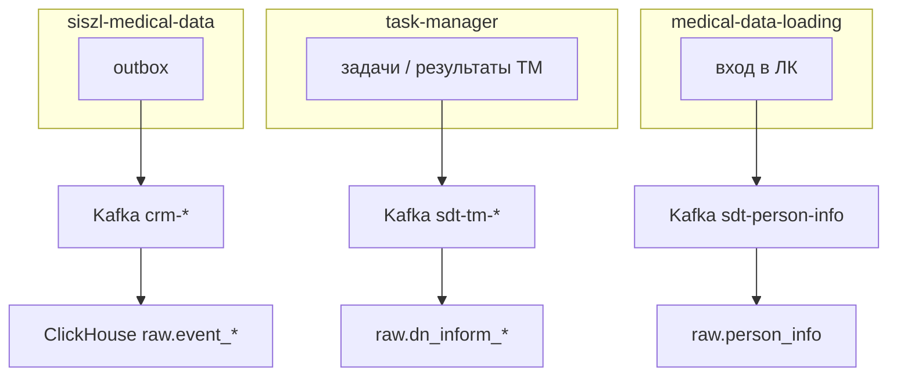

# ClickHouse RAW: архитектура, маппинг и развёртывание (dev)

Единый документ по RAW-слою ClickHouse для отчётности: **архитектура**, **топики Kafka**, **маппинг JSON → колонки**, **DDL** (MergeTree + Kafka Engine + Materialized View).

| | |
|--|--|
| **Среда** | dev2 |
| **Кластер Kafka** | `kafka-svp-01/02/03.gisoms-customer.dev2.pd15.foms.mtp:9093` |
| **Схема CH** | `raw` |
| **Дата** | 2026-05-26 |

**В scope:** 11 потоков Kafka Engine → MV → MergeTree (см. §7).  
**Снято с эксплуатации:** `raw.dn_plan` ← `siszl-dmp-careplan` (DMP-план ДН не используем; план ДН — только `raw.event_dispensary_plan` ← `crm-dispensary-plan`).  
**Вне scope:** prod; слой `dma.*`; прямой ETL из PostgreSQL (`postgresql()`, `raw.etl_watermark`); полные потоки рисков/сигнальных отметок в Kafka (см. §6).

---

## 1. Назначение и принципы

### 1.1. Задача RAW-слоя

RAW — **неизменяемый журнал сообщений** из Kafka: одна строка на каждое принятое сообщение.  
Витрины и отчёты строятся поверх RAW (последнее состояние по `id` / `mpi_oip`, фильтр `event_type != 'DELETE'` для CRM-потоков).

### 1.2. Единственный способ загрузки

Только цепочка:

```
Kafka (JSONAsString)  →  raw.kafka_*  →  raw.mv_*  →  raw.*  (MergeTree)
```

**Не используем:**

- `ENGINE = PostgreSQL()` и периодический `INSERT` из `medical.*`
- `raw.etl_watermark` и PG-снимки `raw.risk` / `raw.signal_mark` / `raw.oms_policy`
- Обязательное участие `siszl-data-transfer` в runtime (см. §5)

---

## 2. Архитектура потоков данных

### 2.1. Две группы форматов на dev

На dev2 все подписки ClickHouse идут на **один брокер** `kafka-svp-*`. По **формату сообщения** потоки делятся на две группы:

| Группа | Топики (факт на dev) | Таблицы RAW | Формат JSON |
|--------|----------------------|-------------|-------------|
| **CRM** | `crm-dispensary-*`, `crm-dispans-*`, `crm-insured-person`, `crm-mo-attachment`, `crm-oms-policy` | `raw.event_*` | Конверт outbox: `eventType`, `eventAt`, `resourceData`, `updateData` |
| **SDT** | `sdt-tm-task`, `sdt-tm-task-result`, `sdt-person-info` | `dn_inform_task`, `dn_inform_rslt`, `person_info` | Плоский DMP / nested (`CmpTask*`), без `eventType` |

Схема (diagrams.net): [`clickhouse-raw-architecture.drawio`](clickhouse-raw-architecture.drawio) — открыть на [diagrams.net](https://app.diagrams.net/) или в VS Code с расширением Draw.io.



### 2.2. Контур CRM (medical-data → outbox → `crm-*`)

**Источник:** сервис `siszl-medical-data`. При CREATE/UPDATE/DELETE сущности в PostgreSQL `medical.*` в outbox попадает Kafka-сообщение.

```
siszl-medical-data  →  siszl_kafka_outbox  →  Kafka crm-<сущность>
                                              →  raw.kafka_event_*  →  mv  →  raw.event_*
```

| Сущность | Класс Kafka (Java) | Топик на dev | Таблица RAW |
|----------|-------------------|--------------|-------------|
| Задачи ДН | `DispensaryTaskKafka` | `crm-dispensary-task` | `raw.event_task` |
| Планы ДН | `DispensaryPlanKafka` | `crm-dispensary-plan` | `raw.event_dispensary_plan` |
| Случай ДН | `DispensaryEpisodeKafka` | `crm-dispensary-episode` | `raw.event_dispensary_episode` |
| Застрахованный | `InsuredPersonKafka` | `crm-insured-person` | `raw.event_insured_person` |
| Планы ДВН | `DispansPlanKafka` | `crm-dispans-plan` | `raw.event_dispans_plan` |
| Задачи ДВН | `DispansTaskKafka` | `crm-dispans-task` | `raw.event_dispans_task` |
| Прикрепление к МО | `MoAttachmentKafka` | `crm-mo-attachment` | `raw.event_mo_attachment` |
| Полис СМО/ТФОМС | `OmsPolicyKafka` | `crm-oms-policy` | `raw.event_oms_policy` |

Имена топиков задаются константами `*.TOPIC_NAME` в `ru.mmdx.svp.kafka.model.*` (jar `svp-lib`). Регистрация в `KafkaSiszlConfig.NEW_TOPICS`.

**Правила конверта CRM:**

| eventType | resourceData | updateData |
|-----------|--------------|------------|
| CREATE | полный снимок сущности | нет |
| UPDATE | новое состояние | `updateData.before` — снимок до изменения |
| DELETE | снимок на момент удаления | обычно нет |

Ключевые поля конверта: `eventType`, `eventAt` (ISO-8601), `resourceData.id`, `resourceData.meta.version`, `resourceData.content.*`, `resourceData.extension.*`, опционально `updateData.before.*`.

### 2.3. Контур SDT — информирование (TM) и вход в ЛК

**Не относится к `crm-*`.** Отдельные продюсеры: **task-manager**, **medical-data-loading**, опционально ретрансляция через **siszl-data-transfer**.

На **dev** подключены топики префикса **`sdt-*`** (сообщения на брокере `kafka-svp`):

| Таблица RAW | Сущность | Топик на dev | Продюсер |
|-------------|----------|--------------|----------|
| `raw.dn_inform_task` | Задача информирования | `sdt-tm-task` | task-manager → DMP (`CmpTaskModel` / плоский JSON) |
| `raw.dn_inform_rslt` | Результат информирования | `sdt-tm-task-result` | task-manager → результат (`tmResultId`, …) |
| `raw.person_info` | Последний вход в ЛК | `sdt-person-info` | loading / SDT (не профиль ЗЛ) |

**Связь задача → результат:** `dn_inform_task.id` (или `task_id`) = `dn_inform_rslt.tm_task_id`.

**Цепочки в коде (для понимания):**

```
TM_TASK_CREATE (внутр. очередь TM)  →  task-manager  →  CmpTaskModel  →  siszl-dmp-tm-task (ЦМП)
                                                              ↓
                                                    sdt-tm-task (на dev в CH)

task-manager  →  результат  →  siszl-dmp-tm-task-result (ЦМП) / sdt-tm-task-result (dev)
```

```
loading  →  patient-account-login (СИСЗЛ)  →  API medical-data
         →  siszl-dmp-person-info (ЦМП)  →  sdt-person-info (на dev в CH)
```

**Не путать:**

| Поток | Таблица | Содержимое |
|-------|---------|------------|
| Профиль ЗЛ (ЕНП, пол, …) | `event_insured_person` | `crm-insured-person`, есть `eventType` |
| Вход в ЛК (дата, ОС) | `person_info` | `sdt-person-info`, нет `eventType` |
| СМО/ТФОМС | `event_oms_policy` | `crm-oms-policy`; ЕНП — в `event_insured_person.enp` |

### 2.4. План ДН — только CRM (`crm-dispensary-plan`)

На dev для отчётности по планам ДН используется **только** поток из `siszl-medical-data`:

```
siszl-medical-data  →  crm-dispensary-plan  →  raw.event_dispensary_plan
```

| | Значение |
|--|----------|
| Топик | `crm-dispensary-plan` (`DispensaryPlanKafka.TOPIC_NAME`) |
| Таблица RAW | `raw.event_dispensary_plan` |
| Ключ плана | `resourceData.id` (UUID) |
| История | CREATE / UPDATE / DELETE (`event_type`, `updateData.before`) |

**Снято:** цепочка `siszl-dmp-careplan` → `raw.dn_plan` (объекты `raw.dn_plan`, `raw.kafka_dn_plan`, `raw.mv_dn_plan` удалены). Топик ЦМП `siszl-dmp-careplan` в ClickHouse **не читаем**.

Связь с случаем ДН: `event_dispensary_plan.dispensary_episode_id` ↔ `event_dispensary_episode.id`.

### 2.5. Параллельные пары «одна сущность — два потока»

| Бизнес-смысл | Поток DMP/SDT | Поток CRM |
|--------------|---------------|-----------|
| План ДН | — | `event_dispensary_plan` |
| Случай ДН | — (на dev только CRM) | `event_dispensary_episode` |
| Задачи ДН | — (на dev только CRM) | `event_task` |
| План ДВН | — | `event_dispans_plan` |
| Задачи ДВН | — | `event_dispans_task` |
| Профиль ЗЛ | — | `event_insured_person` |
| Вход в ЛК | `person_info` | — |

### 2.6. Соответствие потокам siszl-data-transfer → medical-data

`siszl-data-transfer` ретранслирует часть сообщений ЦМП в топики `SDT_*` / `siszl-dmp-*`. **Для ClickHouse на dev он не обязателен** — подписка напрямую на топики с трафиком.

| Было (data-transfer → ЦМП) | Аналог в СИСЗЛ (CRM / SDT) |
|----------------------------|----------------------------|
| `siszl-dmp-careplan` | `crm-dispensary-plan` → `event_dispensary_plan` (в CH не `dn_plan`) |
| `siszl-dmp-plantask` | `crm-dispensary-task` → `event_task` |
| `siszl-dmp-person-info` | `sdt-person-info` → `person_info` (не `crm-insured-person`) |
| `siszl-dmp-dispans-careplan` | `crm-dispans-plan` |
| `siszl-dmp-dispans-plantask` | `crm-dispans-task` |
| `siszl-dmp-tm-task` | `sdt-tm-task` → `dn_inform_task` |
| `siszl-dmp-tm-task-result` | `sdt-tm-task-result` → `dn_inform_rslt` |

---

## 3. Шаблон объекта в ClickHouse

Для **каждого** потока создаются **три объекта** (порядок деплоя):

| Шаг | Объект | Назначение |
|-----|--------|------------|
| 1 | `raw.<table>` | MergeTree — хранение |
| 2 | `raw.kafka_<table>` | Kafka Engine — чтение топика |
| 3 | `raw.mv_<table>` | Materialized View — парсинг `raw_message` |

Общие настройки Kafka Engine на dev:

- `kafka_format = 'JSONAsString'`
- `kafka_max_block_size = 10000`
- уникальный `kafka_group_name` на каждую Kafka-таблицу

**Дедупликация:** на RAW-слое **нет** — история событий хранится полностью. Актуальное состояние для отчёта:

- CRM: `argMax(поле, event_at)` или последняя строка с `event_type != 'DELETE'`
- SDT (TM/ЛК): последняя строка по `mpi_oip` / бизнес-ключу

---

## 4. Риски и сигнальные отметки

На dev **нет** полноценных RAW-таблиц `raw.risk` / `raw.signal_mark` из Kafka.

**Почему:** в `siszl-medical-data` нет outbox по CRUD рисков и сигнальных отметок (`RiskDaoServiceImpl` / `SignalMarkDaoServiceImpl` не публикуют в Kafka). Данные попадают в PostgreSQL `medical.risk` и `medical.signal_mark` через **loading** из ЦМП (REST).

```
ЦМП  →  medical-data-loading  →  PostgreSQL medical.risk / signal_mark
                                      │
                                      ├── (нет outbox crm-risk)
                                      └── риски в составе CmpTaskModel → siszl-dmp-tm-task (ЦМП)
```

Для мониторинга синхронизации из ЦМП в Kafka есть **команды** `{ "createdAt", "cmpId" }` в топиках `risk-upload-task` / `signal-mark-upload-task` — на dev **не развёрнуты** в ClickHouse.

Риски/флаги внутри задачи информирования — снимок в момент отправки TM, не отдельный справочник в RAW.

---

## 5. Связь с siszl-data-transfer

```
medical-data  ──►  crm-*  ──►  ClickHouse raw.event_*

task-manager  ──►  sdt-tm-task / sdt-tm-task-result  ──►  raw.dn_inform_task / raw.dn_inform_rslt

loading  ──►  sdt-person-info  ──►  raw.person_info
```

`siszl-data-transfer` может дублировать потоки `siszl-dmp-*` ↔ `SDT_*`; ClickHouse читает **тот топик, куда реально пишутся сообщения** (на dev — см. §7).

---

## 6. Порядок развёртывания

1. Создать схему `raw` (если нет).
2. Для каждого потока из §7 и Приложения A: **MergeTree → Kafka Engine → MV**.
3. Проверить счётчики (§8).
4. При смене топика или MV: `DETACH`/`DROP` MV и Kafka-таблицы, затем пересоздание (данные в MergeTree сохраняются).

Перед созданием Kafka Engine убедиться в **наличии сообщений** в топике (Kafka UI).

---

## 7. Матрица потоков (dev)

| # | RAW | Топик | Consumer group | Consumers |
|---|-----|-------|----------------|-----------|
| 1 | `dn_inform_rslt` | `sdt-tm-task-result` | `clickhouse_raw_dn_inform_rslt_sdt_v3` | 3 |
| 2 | `dn_inform_task` | `sdt-tm-task` | `clickhouse_raw_dn_inform_task_sdt` | 3 |
| 3 | `event_dispans_plan` | `crm-dispans-plan` | `clickhouse_raw_event_dispans_plan` | 3 |
| 4 | `event_dispans_task` | `crm-dispans-task` | `clickhouse_raw_event_dispans_task` | 5 |
| 5 | `event_dispensary_plan` | `crm-dispensary-plan` | `clickhouse_raw_event_dispensary_plan` | 3 |
| 6 | `event_dispensary_episode` | `crm-dispensary-episode` | `clickhouse_raw_event_dispensary_episode` | 3 |
| 7 | `event_insured_person` | `crm-insured-person` | `clickhouse_raw_event_insured_person` | 3 |
| 8 | `event_mo_attachment` | `crm-mo-attachment` | `clickhouse_raw_event_mo_attachment` | 2 |
| 9 | `event_oms_policy` | `crm-oms-policy` | `clickhouse_raw_event_oms_policy` | 2 |
| 10 | `event_task` | `crm-dispensary-task` | `clickhouse_raw_event_task_v3` | 3 |
| 11 | `person_info` | `sdt-person-info` | `clickhouse_raw_person_info_sdt` | 3 |

## 8. Проверка

```sql
SELECT 'dn_inform_rslt' AS t, count(), toString(max(created_dttm)) FROM raw.dn_inform_rslt
UNION ALL SELECT 'dn_inform_task', count(), toString(max(_loaded_at)) FROM raw.dn_inform_task
UNION ALL SELECT 'event_dispans_plan', count(), toString(max(event_at)) FROM raw.event_dispans_plan
UNION ALL SELECT 'event_dispans_task', count(), toString(max(event_at)) FROM raw.event_dispans_task
UNION ALL SELECT 'event_dispensary_plan', count(), toString(max(event_at)) FROM raw.event_dispensary_plan
UNION ALL SELECT 'event_dispensary_episode', count(), toString(max(event_at)) FROM raw.event_dispensary_episode
UNION ALL SELECT 'event_insured_person', count(), toString(max(event_at)) FROM raw.event_insured_person
UNION ALL SELECT 'event_mo_attachment', count(), toString(max(event_at)) FROM raw.event_mo_attachment
UNION ALL SELECT 'event_oms_policy', count(), toString(max(event_at)) FROM raw.event_oms_policy
UNION ALL SELECT 'event_task', count(), toString(max(event_at)) FROM raw.event_task
UNION ALL SELECT 'person_info', count(), toString(max(_loaded_at)) FROM raw.person_info;
```

## 9. Особенности реализации на dev

| Объект | Особенность |
|--------|-------------|
| `event_task` | TTL **3 года**; в MV должны быть `meta.createdAt/updatedAt` и `extension.executionResults[0]` |
| `event_task` | consumer group `clickhouse_raw_event_task_v3` |
| Плоские потоки | Нет `eventType` — каждое сообщение = новая строка в RAW |

---

## Приложение A. Потоки (JSON + DDL)

Общий конверт **CRM** (`event_*`):

| eventType | resourceData | updateData |
|-----------|--------------|------------|
| CREATE | полный снимок | нет |
| UPDATE | новое состояние | `before` — снимок до изменения |
| DELETE | снимок на момент удаления | обычно нет |

### A.1. `raw.dn_inform_rslt`

**Назначение.** Результат задачи информирования (TM).  
**Конвейер:** `sdt-tm-task-result` → `kafka_dn_inform_rslt` → `mv_dn_inform_rslt` → `dn_inform_rslt`  
**dev2:** Kafka Engine и MV выполняются на **`siszl-worker-adqm-01`** (локальный MergeTree, не реплицируется).

**Скрипты в репозитории:** `docs/clickhouse-raw-cmp/99_drop_dn_inform_rslt.sql`, `00_dn_inform_rslt_sdt_1_mergetree.sql`, `00_dn_inform_rslt_sdt_2_kafka.sql`, `00_dn_inform_rslt_sdt_3_mv.sql`.

#### Пересоздание контура (DROP → CREATE)

Порядок на worker (каждый шаг — отдельный запрос):

1. `DROP VIEW raw.mv_dn_inform_rslt`
2. `DROP TABLE raw.kafka_dn_inform_rslt`
3. `DROP TABLE raw.dn_inform_rslt` — **удаляет все данные**
4. `CREATE TABLE raw.dn_inform_rslt` (скрипт 1)
5. `CREATE TABLE raw.kafka_dn_inform_rslt` (скрипт 2) — **без комментариев после `;` внутри SETTINGS** (иначе `Empty query`)
6. `CREATE MATERIALIZED VIEW raw.mv_dn_inform_rslt` (скрипт 3)

При новой `kafka_group_name` без `kafka_auto_offset_reset = 'earliest'` читаются **только новые** сообщения с конца топика.

**Правка только MV:** шаги 1 и 6 — `kafka_dn_inform_rslt` не трогать; пересчитываются только **новые** сообщения из Kafka.

#### JSON (плоский DMP / nested)

Поля `eventType` нет. Каждое сообщение — новая строка. Поддерживаются два вида имён полей (`tmResultId` или `id`, `result.code` или `tmResultCd`).

**Создание (новый результат)**

```json
{
  "tmResultId": "a1b2c3d4-e5f6-7890-abcd-ef1234567890",
  "tmTaskId": "b2c3d4e5-f6a7-8901-bcde-f12345678901",
  "mpioip": "703545238510",
  "tmResultCd": "01",
  "tmResultName": "Информирован",
  "tmResultSys": "TM_RESULT",
  "communicationMethodCd": "1",
  "communicationMethodName": "Личный кабинет",
  "communicationMethodSys": "COMM_METHOD",
  "createdDttm": "2026-05-06T12:00:00",
  "moCd": "123456",
  "moName": "ГБУЗ Городская больница",
  "tfomsCd": "63",
  "tfomsName": "ТФОМС Самарской области",
  "smoExecutorCd": "63023",
  "smoExecutorName": "СМО Пример",
  "regionSmoCd": "63",
  "masterPersonId": "123456789"
}
```

**Редактирование (повторная публикация / nested)**

```json
{
  "id": "a1b2c3d4-e5f6-7890-abcd-ef1234567890",
  "taskId": "b2c3d4e5-f6a7-8901-bcde-f12345678901",
  "mpioip": "703545238510",
  "result": { "code": "02", "display": "Отказ", "system": "TM_RESULT" },
  "reaction": { "code": "1", "display": "Согласие", "system": "TM_REACTION" },
  "createdAt": "2026-05-07T09:30:00",
  "updateDttm": "2026-05-07T09:30:00"
}
```

**Удаление**

Отдельное событие удаления в топике **обычно не стримится**; в RAW остаётся последняя опубликованная строка. При наличии в топике — снимок с финальным `tmResultCd` и `operationType`: `DELETED` (плоский DMP):

```json
{
  "tmResultId": "a1b2c3d4-e5f6-7890-abcd-ef1234567890",
  "tmTaskId": "b2c3d4e5-f6a7-8901-bcde-f12345678901",
  "mpioip": "703545238510",
  "tmResultCd": "0",
  "tmResultName": "Отменено",
  "tmResultSys": "TM_RESULT",
  "operationType": "DELETED"
}
```

Вариант nested (если в топике нет `tmResultId`, а есть `id` / `result`):

```json
{
  "id": "a1b2c3d4-e5f6-7890-abcd-ef1234567890",
  "taskId": "b2c3d4e5-f6a7-8901-bcde-f12345678901",
  "mpioip": "703545238510",
  "result": { "code": "0", "display": "Отменено", "system": "TM_RESULT" },
  "operationType": "DELETED"
}
```

#### Маппинг nested → колонки RAW (топик `sdt-tm-task-result`)

| JSON | Колонка | Примечание |
|------|---------|------------|
| `id` | `tm_result_id` | |
| `taskId` | `tm_task_id` | |
| `comment` | `comment` | |
| `result.code` / `display` / `system` | `tm_result_*` | |
| `reaction.code` / `display` / `system` | `tm_reaction_*` | `display` → `tm_reaction_name` |
| `communicationMethod.*` | `communication_method_*` | |
| `authorId` | `tm_resultauthor_id` | |
| `createdAt` | `created_dttm` | бизнес-время |
| `smo.*` | `smo_executor_*` | |
| `insertDttm` (DMP) | `insert_dttm` | иначе **`now()`** при INSERT в CH |
| `updateDttm` (DMP) | `update_dttm` | для CREATE обычно `NULL` |
| `masterPersonId`, `groupCd`, `profileCd`, `moCd` (DMP) | одноимённые | для nested без поля → **`NULL`** |
| `mpioip` / `mpiOip` | `mpioip` | для nested часто `''`; обогащение — JOIN `dn_inform_task` |
| `paramsVers`, `operationType` | — | **в RAW не хранятся** |

#### Скрипт 1. MergeTree

```sql
CREATE TABLE raw.dn_inform_rslt
(
    `tm_result_id` UUID,
    `tm_task_id` UUID,
    `comment` Nullable(String),
    `tm_result_cd` String,
    `tm_result_name` String,
    `tm_result_sys` String,
    `tm_reaction_cd` Nullable(String),
    `tm_reaction_name` Nullable(String),
    `tm_reaction_sys` Nullable(String),
    `communication_method_cd` String,
    `communication_method_name` String,
    `communication_method_sys` String,
    `tm_resultauthor_id` Nullable(String),
    `created_dttm` DateTime,
    `smo_executor_cd` String,
    `smo_executor_name` String,
    `smo_executor_sys` String,
    `master_person_id` Nullable(Decimal(38, 0)),
    `mpioip` String,
    `group_cd` Nullable(Decimal(38, 0)),
    `group_name` String,
    `mo_cd` Nullable(FixedString(6)),
    `mo_name` String,
    `tfoms_cd` String,
    `tfoms_name` String,
    `region_smo_cd` String,
    `region_smo_name` String,
    `region_mo_cd` String,
    `region_mo_name` String,
    `profile_cd` Nullable(Decimal(38, 0)),
    `profile_name` String,
    `insert_dttm` Nullable(DateTime),
    `update_dttm` Nullable(DateTime)
)
ENGINE = MergeTree
PARTITION BY toYYYYMM(created_dttm)
ORDER BY (mpioip, tm_result_id, created_dttm)
TTL created_dttm + toIntervalYear(5)
SETTINGS index_granularity = 8192;
```

#### Скрипт 2. Kafka Engine

```sql
CREATE TABLE raw.kafka_dn_inform_rslt
(
    `raw_message` String
)
ENGINE = Kafka
SETTINGS
    kafka_broker_list = 'kafka-svp-01.gisoms-customer.dev2.pd15.foms.mtp:9093,kafka-svp-02.gisoms-customer.dev2.pd15.foms.mtp:9093,kafka-svp-03.gisoms-customer.dev2.pd15.foms.mtp:9093',
    kafka_topic_list = 'sdt-tm-task-result',
    kafka_group_name = 'clickhouse_raw_dn_inform_rslt_sdt_v3',
    kafka_format = 'JSONAsString',
    kafka_num_consumers = 3,
    kafka_max_block_size = 10000;
```

Backfill с начала топика — последняя строка SETTINGS **без `;` перед ней**, запятая после `kafka_max_block_size`:

```sql
    kafka_max_block_size = 10000,
    kafka_auto_offset_reset = 'earliest';
```

#### Семантика дат и DMP-полей

| Колонка | Источник |
|---------|----------|
| `created_dttm` | Бизнес-время: `createdAt` (nested) или `createdDttm` (плоский DMP) |
| `insert_dttm` | `insertDttm` из плоского DMP, иначе **`now()`** при записи в ClickHouse RAW (время загрузки) |
| `update_dttm` | Только `updateDttm` из JSON (UPDATE в DMP); для CREATE обычно `NULL` |
| `master_person_id`, `group_cd`, `profile_cd`, `mo_cd` | Из JSON (плоский DMP); для nested без поля — **`NULL`** (не `0` / `000000`) |

#### Скрипт 3. Materialized View

**CmpTaskResultModel** (SDT): `id`, `taskId`, `result.*`, `reaction.*`, `communicationMethod.*`, `authorId`, `smo.*`, `createdAt`.  
Плоский DMP (ЦМП, `extendCmpTaskResultModel`): `tmResultId`, `tmReactionName`, `insertDttm`, `mpioip`, `moCd`, …

MV **без** явного списка колонок `(...)` — иначе возможен рассинхрон типов и пустые поля при INSERT.

**Nested (пример dev2)**

```json
{
  "id": "b957e0db-844e-46a9-9157-1d8866b4a264",
  "taskId": "be5bb1cc-25c6-48b1-8eae-0db20442b917",
  "comment": "Test",
  "result": { "code": "1", "display": "Проинформирован", "system": "urn:siszl:crm-info-task-result" },
  "reaction": { "code": "APPROVE", "display": "Согласие на МП", "system": "urn:siszl:crm-info-task-reaction" },
  "communicationMethod": { "code": "1", "display": "По телефону", "system": "urn:siszl:crm-connection-info-task" },
  "authorId": "2cf1ebb2-0659-4ed0-a4a7-2a8ccc17e297",
  "createdAt": "2026-05-29T08:20:37.472724586Z",
  "smo": { "code": "52006", "display": "НИЖЕГОРОДСКИЙ ФИЛИАЛ АО \"СТРАХОВАЯ КОМПАНИЯ \"СОГАЗ-МЕД\"", "system": "urn:foms:F002" },
  "paramsVers": "1",
  "operationType": "CREATED"
}
```

Полный SQL: [`clickhouse-raw-cmp/00_dn_inform_rslt_sdt_3_mv.sql`](clickhouse-raw-cmp/00_dn_inform_rslt_sdt_3_mv.sql) (копировать в CH целиком).

#### Диагностика

```sql
SELECT hostName();
SELECT count(), max(created_dttm), max(insert_dttm) FROM raw.dn_inform_rslt;
SELECT table, consumer_id, assignments.topic, num_messages_read, is_currently_used
FROM system.kafka_consumers WHERE database = 'raw' AND table = 'kafka_dn_inform_rslt';
```

- `consumer_id` пустой / `topic=[]` — пересоздать kafka + mv (шаги 1–2, 5–6).
- Kafka читает, `count()=0` — падал INSERT (NOT NULL / `toUUID`); сверить MV со скриптом 3.
- `count()` на coordinator `0`, на worker `>0` — смотреть только worker (локальный MergeTree).
- Прямой `SELECT` из `kafka_*` с MV: код **620** — норма; смотреть `system.kafka_consumers` и целевую таблицу.

---

### A.2. `raw.dn_inform_task`

**Назначение.** Задача информирования (TM).  
**Конвейер:** `sdt-tm-task` → `kafka_dn_inform_task` → `mv_dn_inform_task` → `dn_inform_task`

#### JSON

**Создание**

```json
{
  "id": "c3d4e5f6-a7b8-9012-cdef-123456789012",
  "mpiOip": "703545238510",
  "taskNumber": "TM-2026-0001",
  "taskType": { "code": "INFORM", "display": "Информирование", "system": "TASK_TYPE" },
  "status": { "code": "OPEN", "display": "Открыта", "system": "TASK_STATUS" },
  "mo": { "code": "123456" },
  "tfoms": { "code": "63" },
  "smo": { "code": "63023" },
  "insuredPersonId": "d4e5f6a7-b8c9-0123-def0-234567890123",
  "createdAt": "2026-05-06T08:00:00",
  "plannedStartDate": "2026-05-01",
  "plannedEndDate": "2026-05-31"
}
```

> Денормализованные колонки: `task_id` ← `id`/`taskId`, `planned_visit_date` ← `plannedStartDate`/`plannedVisitDate`, `smo_code_flat` ← `smo.code`/`smoCode`. `communication_method` в задаче обычно нет — см. `dn_inform_rslt` (`sdt-tm-task-result`).

**Редактирование**

```json
{
  "taskId": "c3d4e5f6-a7b8-9012-cdef-123456789012",
  "mpiOip": "703545238510",
  "status": { "code": "DONE", "display": "Выполнена", "system": "TASK_STATUS" },
  "updatedAt": "2026-05-06T14:00:00",
  "closeDate": "2026-05-06"
}
```

**Удаление**

Отдельное событие в топике **обычно не стримится**. При наличии — снимок с финальным `status` / `closeDate` и `operationType`: `DELETED`:

```json
{
  "id": "c3d4e5f6-a7b8-9012-cdef-123456789012",
  "mpiOip": "703545238510",
  "status": { "code": "CANCELLED", "display": "Отменена", "system": "TASK_STATUS" },
  "closeDate": "2026-06-20",
  "updatedAt": "2026-06-20T10:00:00+03:00",
  "operationType": "DELETED"
}
```

#### Скрипт 1. MergeTree

```sql
CREATE TABLE raw.dn_inform_task
(
    `id` UUID,
    `mpi_oip` String,
    `params_vers` Nullable(String),
    `task_number` Nullable(String),
    `task_type_cd` Nullable(String),
    `task_type_name` Nullable(String),
    `task_type_sys` Nullable(String),
    `episode_type_cd` Nullable(String),
    `episode_type_name` Nullable(String),
    `episode_type_sys` Nullable(String),
    `status_cd` Nullable(String),
    `status_name` Nullable(String),
    `status_sys` Nullable(String),
    `diagnosis_cd` Nullable(String),
    `end_date` Nullable(Date),
    `tfoms_cd` Nullable(String),
    `mo_cd` Nullable(String),
    `planned_start_date` Nullable(Date),
    `planned_end_date` Nullable(Date),
    `diagnosis_group_cd` Nullable(String),
    `disp_type_cd` Nullable(String),
    `medical_profile_cd` Nullable(String),
    `gender_cd` Nullable(String),
    `full_age` Nullable(Int32),
    `smo_cd` Nullable(String),
    `smo_user_id` Nullable(String),
    `insured_person_id` Nullable(UUID),
    `created_at` Nullable(DateTime),
    `updated_at` Nullable(DateTime),
    `close_date` Nullable(Date),
    `creation_type` Nullable(String),
    `logical_id` Nullable(String),
    `comment` Nullable(String),
    `episode_id` Nullable(UUID),
    `episode_cmp_id` Nullable(String),
    `operation_type` Nullable(String),
    `task_id` Nullable(UUID),
    `planned_visit_date` Nullable(Date),
    `task_type_flat` Nullable(String),
    `communication_method` Nullable(String),
    `smo_code_flat` Nullable(String),
    `_loaded_at` DateTime DEFAULT now()
)
ENGINE = MergeTree
PARTITION BY toYYYYMM(coalesce(created_at, _loaded_at))
ORDER BY (mpi_oip, id, _loaded_at)
TTL _loaded_at + toIntervalYear(5)
SETTINGS index_granularity = 8192;
```

#### Скрипт 2. Kafka Engine

```sql
CREATE TABLE raw.kafka_dn_inform_task
(
    `raw_message` String
)
ENGINE = Kafka
SETTINGS
    kafka_broker_list = 'kafka-svp-01.gisoms-customer.dev2.pd15.foms.mtp:9093,kafka-svp-02.gisoms-customer.dev2.pd15.foms.mtp:9093,kafka-svp-03.gisoms-customer.dev2.pd15.foms.mtp:9093',
    kafka_topic_list = 'sdt-tm-task',
    kafka_group_name = 'clickhouse_raw_dn_inform_task_sdt',
    kafka_format = 'JSONAsString',
    kafka_num_consumers = 3,
    kafka_max_block_size = 10000;
```

#### Скрипт 3. Materialized View

```sql
CREATE MATERIALIZED VIEW raw.mv_dn_inform_task TO raw.dn_inform_task AS
SELECT
    coalesce(toUUIDOrNull(JSONExtractString(raw_message, 'id')), toUUIDOrNull(JSONExtractString(raw_message, 'taskId'))) AS id,
    JSONExtractString(raw_message, 'mpiOip') AS mpi_oip,
    nullIf(JSONExtractString(raw_message, 'paramsVers'), '') AS params_vers,
    nullIf(JSONExtractString(raw_message, 'taskNumber'), '') AS task_number,
    coalesce(nullIf(JSONExtractString(raw_message, 'taskType', 'code'), ''), nullIf(JSONExtractString(raw_message, 'taskType'), '')) AS task_type_cd,
    nullIf(JSONExtractString(raw_message, 'taskType', 'display'), '') AS task_type_name,
    nullIf(JSONExtractString(raw_message, 'taskType', 'system'), '') AS task_type_sys,
    nullIf(JSONExtractString(raw_message, 'episodeType', 'code'), '') AS episode_type_cd,
    nullIf(JSONExtractString(raw_message, 'episodeType', 'display'), '') AS episode_type_name,
    nullIf(JSONExtractString(raw_message, 'episodeType', 'system'), '') AS episode_type_sys,
    nullIf(JSONExtractString(raw_message, 'status', 'code'), '') AS status_cd,
    nullIf(JSONExtractString(raw_message, 'status', 'display'), '') AS status_name,
    nullIf(JSONExtractString(raw_message, 'status', 'system'), '') AS status_sys,
    nullIf(JSONExtractString(raw_message, 'diagnosis', 'code'), '') AS diagnosis_cd,
    toDateOrNull(JSONExtractString(raw_message, 'endDate')) AS end_date,
    nullIf(JSONExtractString(raw_message, 'tfoms', 'code'), '') AS tfoms_cd,
    nullIf(JSONExtractString(raw_message, 'mo', 'code'), '') AS mo_cd,
    toDateOrNull(JSONExtractString(raw_message, 'plannedStartDate')) AS planned_start_date,
    toDateOrNull(JSONExtractString(raw_message, 'plannedEndDate')) AS planned_end_date,
    nullIf(JSONExtractString(raw_message, 'diagnosisGroup', 'code'), '') AS diagnosis_group_cd,
    nullIf(JSONExtractString(raw_message, 'dispType', 'code'), '') AS disp_type_cd,
    nullIf(JSONExtractString(raw_message, 'medicalProfile', 'code'), '') AS medical_profile_cd,
    nullIf(JSONExtractString(raw_message, 'gender', 'code'), '') AS gender_cd,
    toInt32OrNull(JSONExtractString(raw_message, 'fullAge')) AS full_age,
    nullIf(JSONExtractString(raw_message, 'smo', 'code'), '') AS smo_cd,
    nullIf(JSONExtractString(raw_message, 'smoUserId'), '') AS smo_user_id,
    toUUIDOrNull(JSONExtractString(raw_message, 'insuredPersonId')) AS insured_person_id,
    parseDateTimeBestEffortOrNull(JSONExtractString(raw_message, 'createdAt')) AS created_at,
    parseDateTimeBestEffortOrNull(JSONExtractString(raw_message, 'updatedAt')) AS updated_at,
    toDateOrNull(JSONExtractString(raw_message, 'closeDate')) AS close_date,
    nullIf(JSONExtractString(raw_message, 'creationType'), '') AS creation_type,
    nullIf(JSONExtractString(raw_message, 'logicalId'), '') AS logical_id,
    nullIf(JSONExtractString(raw_message, 'comment'), '') AS comment,
    toUUIDOrNull(JSONExtractString(raw_message, 'episodeId')) AS episode_id,
    nullIf(JSONExtractString(raw_message, 'episodeCmpId'), '') AS episode_cmp_id,
    nullIf(JSONExtractString(raw_message, 'operationType'), '') AS operation_type,
    coalesce(toUUIDOrNull(JSONExtractString(raw_message, 'taskId')), toUUIDOrNull(JSONExtractString(raw_message, 'id'))) AS task_id,
    toDateOrNull(coalesce(nullIf(JSONExtractString(raw_message, 'plannedVisitDate'), ''), nullIf(JSONExtractString(raw_message, 'plannedStartDate'), ''))) AS planned_visit_date,
    coalesce(nullIf(JSONExtractString(raw_message, 'taskType'), ''), nullIf(JSONExtractString(raw_message, 'taskType', 'code'), '')) AS task_type_flat,
    coalesce(nullIf(JSONExtractString(raw_message, 'communicationMethod'), ''), nullIf(JSONExtractString(raw_message, 'communicationMethod', 'display'), ''), nullIf(JSONExtractString(raw_message, 'communicationMethod', 'code'), '')) AS communication_method,
    coalesce(nullIf(JSONExtractString(raw_message, 'smoCode'), ''), nullIf(JSONExtractString(raw_message, 'smo', 'code'), '')) AS smo_code_flat,
    now() AS _loaded_at
FROM raw.kafka_dn_inform_task;
```

### A.3. `raw.dn_plan` — снято с эксплуатации

Поток **не входит** в scope dev. Объекты удалены:

```sql
DROP VIEW IF EXISTS raw.mv_dn_plan;
DROP TABLE IF EXISTS raw.kafka_dn_plan;
DROP TABLE IF EXISTS raw.dn_plan;
```

План ДН в RAW: см. **A.6** `raw.event_dispensary_plan` ← `crm-dispensary-plan`.  
Скрипт деплоя: [`clickhouse-raw-siszl/02_event_dispensary_plan.sql`](clickhouse-raw-siszl/02_event_dispensary_plan.sql).

---

### A.4. `raw.event_dispans_plan`

**Конвейер:** `crm-dispans-plan` → `kafka_event_dispans_plan` → `mv_event_dispans_plan` → `event_dispans_plan`

#### JSON

**CREATE**

```json
{
  "eventType": "CREATE",
  "eventAt": "2026-05-06T10:00:00.123456Z",
  "resourceData": {
    "id": "11111111-2222-3333-4444-555555555501",
    "meta": { "version": 1, "createdAt": "2026-05-06T10:00:00Z", "updatedAt": null },
    "content": {
      "title": "План ДВН 2026",
      "executionStateReference": "CARE_PLAN_EXECUTION_STATUS/1",
      "period": { "startDateInclude": "2026-01-01", "endDateInclude": "2026-12-31" },
      "dispansEpisodeId": "aaaaaaaa-bbbb-cccc-dddd-eeeeeeeeee01",
      "dispansPlanTemplateId": "tpl-uuid-01"
    },
    "extension": { "insuredPerson": { "id": "ip-uuid-01", "mpiOip": "703545238510" } }
  }
}
```

**UPDATE**

```json
{
  "eventType": "UPDATE",
  "eventAt": "2026-05-10T11:00:00.123456Z",
  "resourceData": {
    "id": "11111111-2222-3333-4444-555555555501",
    "meta": { "version": 2, "createdAt": "2026-05-06T10:00:00Z", "updatedAt": "2026-05-10T11:00:00Z" },
    "content": {
      "title": "План ДВН 2026",
      "executionStateReference": "CARE_PLAN_EXECUTION_STATUS/2",
      "period": { "startDateInclude": "2026-01-01", "endDateInclude": "2026-12-31" },
      "dispansEpisodeId": "aaaaaaaa-bbbb-cccc-dddd-eeeeeeeeee01",
      "dispansPlanTemplateId": "tpl-uuid-01"
    },
    "extension": { "insuredPerson": { "id": "ip-uuid-01", "mpiOip": "703545238510" } }
  },
  "updateData": {
    "before": {
      "content": {
        "executionStateReference": "CARE_PLAN_EXECUTION_STATUS/1",
        "period": { "startDateInclude": "2026-01-01", "endDateInclude": "2026-12-31" }
      }
    }
  }
}
```

**DELETE**

```json
{
  "eventType": "DELETE",
  "eventAt": "2026-06-01T09:00:00.123456Z",
  "resourceData": {
    "id": "11111111-2222-3333-4444-555555555501",
    "meta": { "version": 3, "createdAt": "2026-05-06T10:00:00Z", "updatedAt": "2026-06-01T09:00:00Z" },
    "content": {
      "executionStateReference": "CARE_PLAN_EXECUTION_STATUS/9",
      "period": { "startDateInclude": "2026-01-01", "endDateInclude": "2026-05-31" },
      "dispansEpisodeId": "aaaaaaaa-bbbb-cccc-dddd-eeeeeeeeee01",
      "dispansPlanTemplateId": "tpl-uuid-01"
    },
    "extension": { "insuredPerson": { "mpiOip": "703545238510" } }
  }
}
```

#### Скрипт 1. MergeTree

```sql
CREATE TABLE raw.event_dispans_plan
(
    `event_type` LowCardinality(String),
    `event_at` DateTime64(6),
    `id` String,
    `version` UInt64,
    `created_at` Nullable(DateTime64(6)),
    `updated_at` Nullable(DateTime64(6)),
    `title` Nullable(String),
    `execution_state_reference` LowCardinality(String),
    `period_start` Nullable(Date),
    `period_end` Nullable(Date),
    `dispans_episode_id` String,
    `dispans_plan_template_id` String,
    `insured_person_id` String,
    `mpi_oip` String,
    `before_execution_state_ref` Nullable(String),
    `before_period_start` Nullable(Date),
    `before_period_end` Nullable(Date),
    `_loaded_at` DateTime64(3) DEFAULT now64(3)
)
ENGINE = MergeTree
PARTITION BY toYYYYMM(event_at)
ORDER BY (mpi_oip, id, event_at)
TTL toDateTime(event_at) + toIntervalYear(5)
SETTINGS index_granularity = 8192;
```

#### Скрипт 2. Kafka Engine

```sql
CREATE TABLE raw.kafka_event_dispans_plan
(
    `raw_message` String
)
ENGINE = Kafka
SETTINGS
    kafka_broker_list = 'kafka-svp-01.gisoms-customer.dev2.pd15.foms.mtp:9093,kafka-svp-02.gisoms-customer.dev2.pd15.foms.mtp:9093,kafka-svp-03.gisoms-customer.dev2.pd15.foms.mtp:9093',
    kafka_topic_list = 'crm-dispans-plan',
    kafka_group_name = 'clickhouse_raw_event_dispans_plan',
    kafka_format = 'JSONAsString',
    kafka_num_consumers = 3,
    kafka_max_block_size = 10000;
```

#### Скрипт 3. Materialized View

```sql
CREATE MATERIALIZED VIEW raw.mv_event_dispans_plan TO raw.event_dispans_plan AS
SELECT
    JSONExtractString(raw_message, 'eventType') AS event_type,
    parseDateTime64BestEffort(JSONExtractString(raw_message, 'eventAt'), 6) AS event_at,
    JSONExtractString(raw_message, 'resourceData', 'id') AS id,
    toUInt64OrZero(JSONExtractString(raw_message, 'resourceData', 'meta', 'version')) AS version,
    parseDateTime64BestEffortOrNull(JSONExtractString(raw_message, 'resourceData', 'meta', 'createdAt'), 6) AS created_at,
    parseDateTime64BestEffortOrNull(JSONExtractString(raw_message, 'resourceData', 'meta', 'updatedAt'), 6) AS updated_at,
    nullIf(JSONExtractString(raw_message, 'resourceData', 'content', 'title'), '') AS title,
    JSONExtractString(raw_message, 'resourceData', 'content', 'executionStateReference') AS execution_state_reference,
    toDateOrNull(JSONExtractString(raw_message, 'resourceData', 'content', 'period', 'startDateInclude')) AS period_start,
    toDateOrNull(JSONExtractString(raw_message, 'resourceData', 'content', 'period', 'endDateInclude')) AS period_end,
    JSONExtractString(raw_message, 'resourceData', 'content', 'dispansEpisodeId') AS dispans_episode_id,
    JSONExtractString(raw_message, 'resourceData', 'content', 'dispansPlanTemplateId') AS dispans_plan_template_id,
    JSONExtractString(raw_message, 'resourceData', 'extension', 'insuredPerson', 'id') AS insured_person_id,
    JSONExtractString(raw_message, 'resourceData', 'extension', 'insuredPerson', 'mpiOip') AS mpi_oip,
    nullIf(JSONExtractString(raw_message, 'updateData', 'before', 'content', 'executionStateReference'), '') AS before_execution_state_ref,
    toDateOrNull(JSONExtractString(raw_message, 'updateData', 'before', 'content', 'period', 'startDateInclude')) AS before_period_start,
    toDateOrNull(JSONExtractString(raw_message, 'updateData', 'before', 'content', 'period', 'endDateInclude')) AS before_period_end,
    now64(3) AS _loaded_at
FROM raw.kafka_event_dispans_plan;
```

### A.5. `raw.event_dispans_task`

**Конвейер:** `crm-dispans-task` → `kafka_event_dispans_task` → `mv_event_dispans_task` → `event_dispans_task`

#### JSON

**CREATE**

```json
{
  "eventType": "CREATE",
  "eventAt": "2026-05-06T10:00:00.123456Z",
  "resourceData": {
    "id": "22222222-3333-4444-5555-666666666602",
    "meta": { "version": 1, "createdAt": "2026-05-06T10:00:00Z", "updatedAt": null },
    "content": {
      "taskReference": "TASK/12",
      "taskGroupReference": "TASK_GROUP/1",
      "stateReference": "TASK_BUSINESS_STATUS/1",
      "restrictionPeriod": { "startDateInclude": "2026-06-01", "endDateInclude": "2026-09-01" }
    },
    "extension": {
      "insuredPerson": { "id": "ip-uuid-01", "mpiOip": "703545238510" },
      "dispansPlan": { "id": "11111111-2222-3333-4444-555555555501" },
      "dispansAction": { "id": "action-uuid-01", "actionId": "59339dd" }
    }
  }
}
```

> `dispans_episode_id` в топике задачи **нет** (`DispansTaskKafka.Extension` без `dispansEpisode`). Обогащение: `dispans_plan_id` → join `raw.event_dispans_plan.dispans_episode_id`.

**UPDATE**

```json
{
  "eventType": "UPDATE",
  "eventAt": "2026-05-12T14:00:00.123456Z",
  "resourceData": {
    "id": "22222222-3333-4444-5555-666666666602",
    "meta": { "version": 2, "createdAt": "2026-05-06T10:00:00Z", "updatedAt": "2026-05-12T14:00:00Z" },
    "content": {
      "stateReference": "TASK_BUSINESS_STATUS/2",
      "taskReference": "TASK/12",
      "restrictionPeriod": { "startDateInclude": "2026-06-01", "endDateInclude": "2026-09-01" }
    },
    "extension": {
      "insuredPerson": { "mpiOip": "703545238510" },
      "dispansPlan": { "id": "11111111-2222-3333-4444-555555555501" },
      "dispansAction": { "id": "action-uuid-01", "actionId": "59339dd" }
    }
  },
  "updateData": {
    "before": {
      "content": {
        "stateReference": "TASK_BUSINESS_STATUS/1",
        "restrictionPeriod": { "startDateInclude": "2026-06-01", "endDateInclude": "2026-09-01" }
      }
    }
  }
}
```

**DELETE**

```json
{
  "eventType": "DELETE",
  "eventAt": "2026-05-20T16:00:00.123456Z",
  "resourceData": {
    "id": "22222222-3333-4444-5555-666666666602",
    "meta": { "version": 3, "createdAt": "2026-05-06T10:00:00Z", "updatedAt": "2026-05-20T16:00:00Z" },
    "content": { "stateReference": "TASK_BUSINESS_STATUS/9", "taskReference": "TASK/12" },
    "extension": { "dispansAction": { "id": "action-uuid-01" } },
    "extension": { "insuredPerson": { "mpiOip": "703545238510" }, "dispansPlan": { "id": "11111111-2222-3333-4444-555555555501" } }
  }
}
```

#### Скрипт 1. MergeTree

```sql
CREATE TABLE raw.event_dispans_task
(
    `event_type` LowCardinality(String),
    `event_at` DateTime64(6),
    `id` String,
    `version` UInt64,
    `created_at` Nullable(DateTime64(6)),
    `updated_at` Nullable(DateTime64(6)),
    `state_reference` LowCardinality(String),
    `task_reference` LowCardinality(String),
    `task_group_reference` LowCardinality(String),
    `dispans_action_id` String,
    `restriction_period_start` Nullable(Date),
    `restriction_period_end` Nullable(Date),
    `insured_person_id` String,
    `mpi_oip` String,
    `dispans_plan_id` String,
    `dispans_episode_id` String,
    `before_state_reference` Nullable(String),
    `before_restriction_start` Nullable(Date),
    `before_restriction_end` Nullable(Date),
    `_loaded_at` DateTime64(3) DEFAULT now64(3)
)
ENGINE = MergeTree
PARTITION BY toYYYYMM(event_at)
ORDER BY (mpi_oip, id, event_at)
TTL toDateTime(event_at) + toIntervalYear(5)
SETTINGS index_granularity = 8192;
```

#### Скрипт 2. Kafka Engine

```sql
CREATE TABLE raw.kafka_event_dispans_task
(
    `raw_message` String
)
ENGINE = Kafka
SETTINGS
    kafka_broker_list = 'kafka-svp-01.gisoms-customer.dev2.pd15.foms.mtp:9093,kafka-svp-02.gisoms-customer.dev2.pd15.foms.mtp:9093,kafka-svp-03.gisoms-customer.dev2.pd15.foms.mtp:9093',
    kafka_topic_list = 'crm-dispans-task',
    kafka_group_name = 'clickhouse_raw_event_dispans_task',
    kafka_format = 'JSONAsString',
    kafka_num_consumers = 5,
    kafka_max_block_size = 10000;
```

#### Скрипт 3. Materialized View

```sql
CREATE MATERIALIZED VIEW raw.mv_event_dispans_task TO raw.event_dispans_task AS
SELECT
    JSONExtractString(raw_message, 'eventType') AS event_type,
    parseDateTime64BestEffort(JSONExtractString(raw_message, 'eventAt'), 6) AS event_at,
    JSONExtractString(raw_message, 'resourceData', 'id') AS id,
    toUInt64OrZero(JSONExtractString(raw_message, 'resourceData', 'meta', 'version')) AS version,
    parseDateTime64BestEffortOrNull(JSONExtractString(raw_message, 'resourceData', 'meta', 'createdAt'), 6) AS created_at,
    parseDateTime64BestEffortOrNull(JSONExtractString(raw_message, 'resourceData', 'meta', 'updatedAt'), 6) AS updated_at,
    JSONExtractString(raw_message, 'resourceData', 'content', 'stateReference') AS state_reference,
    JSONExtractString(raw_message, 'resourceData', 'content', 'taskReference') AS task_reference,
    JSONExtractString(raw_message, 'resourceData', 'content', 'taskGroupReference') AS task_group_reference,
    coalesce(
        nullIf(JSONExtractString(raw_message, 'resourceData', 'extension', 'dispansAction', 'id'), ''),
        nullIf(JSONExtractString(raw_message, 'resourceData', 'content', 'dispansActionId'), '')
    ) AS dispans_action_id,
    toDateOrNull(JSONExtractString(raw_message, 'resourceData', 'content', 'restrictionPeriod', 'startDateInclude')) AS restriction_period_start,
    toDateOrNull(JSONExtractString(raw_message, 'resourceData', 'content', 'restrictionPeriod', 'endDateInclude')) AS restriction_period_end,
    JSONExtractString(raw_message, 'resourceData', 'extension', 'insuredPerson', 'id') AS insured_person_id,
    JSONExtractString(raw_message, 'resourceData', 'extension', 'insuredPerson', 'mpiOip') AS mpi_oip,
    JSONExtractString(raw_message, 'resourceData', 'extension', 'dispansPlan', 'id') AS dispans_plan_id,
    coalesce(
        nullIf(JSONExtractString(raw_message, 'resourceData', 'extension', 'dispansEpisode', 'id'), ''),
        nullIf(JSONExtractString(raw_message, 'resourceData', 'content', 'dispansEpisodeId'), '')
    ) AS dispans_episode_id,
    nullIf(JSONExtractString(raw_message, 'updateData', 'before', 'content', 'stateReference'), '') AS before_state_reference,
    toDateOrNull(JSONExtractString(raw_message, 'updateData', 'before', 'content', 'restrictionPeriod', 'startDateInclude')) AS before_restriction_start,
    toDateOrNull(JSONExtractString(raw_message, 'updateData', 'before', 'content', 'restrictionPeriod', 'endDateInclude')) AS before_restriction_end,
    now64(3) AS _loaded_at
FROM raw.kafka_event_dispans_task;
```

---

### A.6. `raw.event_dispensary_plan`

**Конвейер:** `crm-dispensary-plan` → `kafka_event_dispensary_plan` → `mv_event_dispensary_plan` → `event_dispensary_plan`

#### JSON

**CREATE**

```json
{
  "eventType": "CREATE",
  "eventAt": "2026-05-06T10:00:00.123456Z",
  "resourceData": {
    "id": "33333333-4444-5555-6666-777777777703",
    "meta": { "version": 1, "createdAt": "2026-05-06T10:00:00Z", "updatedAt": null },
    "content": {
      "title": "План ДН 2026",
      "state": "ACTIVE",
      "executionStateReference": "CARE_PLAN_EXECUTION_STATUS/1",
      "medicalProfileReference": "MEDICAL_PROFILE/1",
      "diagnosisGroupReference": "DIAGNOSIS_GROUP/1",
      "durationTypeReference": "DURATION_TYPE/1",
      "period": { "startDateInclude": "2026-01-01", "endDateInclude": "2026-12-31" },
      "dispensaryEpisodeId": "ep-uuid-dn-01",
      "dispensaryPlanTemplateId": "tpl-dn-01"
    },
    "extension": { "insuredPerson": { "id": "ip-uuid-01", "mpiOip": "703545238510" } }
  }
}
```

**UPDATE**

```json
{
  "eventType": "UPDATE",
  "eventAt": "2026-05-15T11:00:00.123456Z",
  "resourceData": {
    "id": "33333333-4444-5555-6666-777777777703",
    "meta": { "version": 2, "createdAt": "2026-05-06T10:00:00Z", "updatedAt": "2026-05-15T11:00:00Z" },
    "content": {
      "state": "ACTIVE",
      "executionStateReference": "CARE_PLAN_EXECUTION_STATUS/2",
      "period": { "startDateInclude": "2026-01-01", "endDateInclude": "2026-10-31" },
      "dispensaryEpisodeId": "ep-uuid-dn-01",
      "dispensaryPlanTemplateId": "tpl-dn-01"
    },
    "extension": { "insuredPerson": { "mpiOip": "703545238510" } }
  },
  "updateData": {
    "before": {
      "content": {
        "executionStateReference": "CARE_PLAN_EXECUTION_STATUS/1",
        "period": { "startDateInclude": "2026-01-01", "endDateInclude": "2026-12-31" }
      }
    }
  }
}
```

**DELETE**

```json
{
  "eventType": "DELETE",
  "eventAt": "2026-06-01T09:00:00.123456Z",
  "resourceData": {
    "id": "33333333-4444-5555-6666-777777777703",
    "meta": { "version": 3, "createdAt": "2026-05-06T10:00:00Z", "updatedAt": "2026-06-01T09:00:00Z" },
    "content": {
      "state": "CLOSED",
      "executionStateReference": "CARE_PLAN_EXECUTION_STATUS/9",
      "dispensaryEpisodeId": "ep-uuid-dn-01",
      "dispensaryPlanTemplateId": "tpl-dn-01"
    },
    "extension": { "insuredPerson": { "mpiOip": "703545238510" } }
  }
}
```

#### Скрипт 1. MergeTree

```sql
CREATE TABLE raw.event_dispensary_plan
(
    `event_type` LowCardinality(String),
    `event_at` DateTime64(6),
    `id` String,
    `version` UInt64,
    `created_at` Nullable(DateTime64(6)),
    `updated_at` Nullable(DateTime64(6)),
    `title` Nullable(String),
    `state` Nullable(String),
    `execution_state_reference` LowCardinality(String),
    `medical_profile_reference` LowCardinality(String),
    `diagnosis_group_reference` LowCardinality(String),
    `duration_type_reference` LowCardinality(String),
    `period_start` Nullable(Date),
    `period_end` Nullable(Date),
    `dispensary_episode_id` String,
    `dispensary_plan_template_id` String,
    `insured_person_id` String,
    `mpi_oip` String,
    `before_execution_state_ref` Nullable(String),
    `before_period_start` Nullable(Date),
    `before_period_end` Nullable(Date),
    `_loaded_at` DateTime64(3) DEFAULT now64(3)
)
ENGINE = MergeTree
PARTITION BY toYYYYMM(event_at)
ORDER BY (mpi_oip, id, event_at)
TTL toDateTime(event_at) + toIntervalYear(5)
SETTINGS index_granularity = 8192;
```

#### Скрипт 2. Kafka Engine

```sql
CREATE TABLE raw.kafka_event_dispensary_plan
(
    `raw_message` String
)
ENGINE = Kafka
SETTINGS
    kafka_broker_list = 'kafka-svp-01.gisoms-customer.dev2.pd15.foms.mtp:9093,kafka-svp-02.gisoms-customer.dev2.pd15.foms.mtp:9093,kafka-svp-03.gisoms-customer.dev2.pd15.foms.mtp:9093',
    kafka_topic_list = 'crm-dispensary-plan',
    kafka_group_name = 'clickhouse_raw_event_dispensary_plan',
    kafka_format = 'JSONAsString',
    kafka_num_consumers = 3,
    kafka_max_block_size = 10000;
```

#### Скрипт 3. Materialized View

```sql
CREATE MATERIALIZED VIEW raw.mv_event_dispensary_plan TO raw.event_dispensary_plan AS
SELECT
    JSONExtractString(raw_message, 'eventType') AS event_type,
    parseDateTime64BestEffort(JSONExtractString(raw_message, 'eventAt'), 6) AS event_at,
    JSONExtractString(raw_message, 'resourceData', 'id') AS id,
    toUInt64OrZero(JSONExtractString(raw_message, 'resourceData', 'meta', 'version')) AS version,
    parseDateTime64BestEffortOrNull(JSONExtractString(raw_message, 'resourceData', 'meta', 'createdAt'), 6) AS created_at,
    parseDateTime64BestEffortOrNull(JSONExtractString(raw_message, 'resourceData', 'meta', 'updatedAt'), 6) AS updated_at,
    nullIf(JSONExtractString(raw_message, 'resourceData', 'content', 'title'), '') AS title,
    nullIf(JSONExtractString(raw_message, 'resourceData', 'content', 'state'), '') AS state,
    JSONExtractString(raw_message, 'resourceData', 'content', 'executionStateReference') AS execution_state_reference,
    JSONExtractString(raw_message, 'resourceData', 'content', 'medicalProfileReference') AS medical_profile_reference,
    JSONExtractString(raw_message, 'resourceData', 'content', 'diagnosisGroupReference') AS diagnosis_group_reference,
    JSONExtractString(raw_message, 'resourceData', 'content', 'durationTypeReference') AS duration_type_reference,
    toDateOrNull(JSONExtractString(raw_message, 'resourceData', 'content', 'period', 'startDateInclude')) AS period_start,
    toDateOrNull(JSONExtractString(raw_message, 'resourceData', 'content', 'period', 'endDateInclude')) AS period_end,
    JSONExtractString(raw_message, 'resourceData', 'content', 'dispensaryEpisodeId') AS dispensary_episode_id,
    JSONExtractString(raw_message, 'resourceData', 'content', 'dispensaryPlanTemplateId') AS dispensary_plan_template_id,
    JSONExtractString(raw_message, 'resourceData', 'extension', 'insuredPerson', 'id') AS insured_person_id,
    JSONExtractString(raw_message, 'resourceData', 'extension', 'insuredPerson', 'mpiOip') AS mpi_oip,
    nullIf(JSONExtractString(raw_message, 'updateData', 'before', 'content', 'executionStateReference'), '') AS before_execution_state_ref,
    toDateOrNull(JSONExtractString(raw_message, 'updateData', 'before', 'content', 'period', 'startDateInclude')) AS before_period_start,
    toDateOrNull(JSONExtractString(raw_message, 'updateData', 'before', 'content', 'period', 'endDateInclude')) AS before_period_end,
    now64(3) AS _loaded_at
FROM raw.kafka_event_dispensary_plan;
```

---

### A.6.1. `raw.event_dispensary_episode`

**Назначение.** Случай диспансерного наблюдения (ДН).  
**Конвейер:** `crm-dispensary-episode` → `kafka_event_dispensary_episode` → `mv_event_dispensary_episode` → `event_dispensary_episode`  
**Скрипт:** [`clickhouse-raw-siszl/09_event_dispensary_episode.sql`](clickhouse-raw-siszl/09_event_dispensary_episode.sql)

#### JSON

**CREATE**

```json
{
  "eventType": "CREATE",
  "eventAt": "2026-05-06T10:00:00.123456Z",
  "resourceData": {
    "id": "7ecb0197-560d-4a4b-a300-c098d8e6bd9c",
    "meta": { "version": 0, "createdAt": "2026-05-06T10:00:00Z", "updatedAt": null },
    "content": {
      "cmpId": "4382021",
      "insuredPersonId": "d4e5f6a7-b8c9-0123-def0-234567890123",
      "diseaseId": "8e4ca025-808e-4536-bba0-ffff1d145a55",
      "diagnosisGroupReference": "GROUP_RH/302",
      "stateReference": "DISPENSARY_EPISODE_STATE/1",
      "mo": { "moReference": "NSI_MO/123456", "siteName": "Участок 12" },
      "doctor": { "specialityReference": "DOCTOR_SPECIALITY/1", "text": "Иванов И.И." },
      "period": { "startDateInclude": "2024-01-01", "endDateInclude": null }
    },
    "extension": {
      "insuredPerson": { "id": "d4e5f6a7-b8c9-0123-def0-234567890123", "mpiOip": "703545238510" },
      "diagnosisReference": "DIAGNOSIS/1"
    }
  }
}
```

**UPDATE**

```json
{
  "eventType": "UPDATE",
  "eventAt": "2026-05-15T11:00:00.123456Z",
  "resourceData": {
    "id": "7ecb0197-560d-4a4b-a300-c098d8e6bd9c",
    "meta": { "version": 1, "createdAt": "2026-05-06T10:00:00Z", "updatedAt": "2026-05-15T11:00:00Z" },
    "content": {
      "cmpId": "4382021",
      "insuredPersonId": "d4e5f6a7-b8c9-0123-def0-234567890123",
      "diseaseId": "8e4ca025-808e-4536-bba0-ffff1d145a55",
      "diagnosisGroupReference": "GROUP_RH/302",
      "stateReference": "DISPENSARY_EPISODE_STATE/2",
      "mo": { "moReference": "NSI_MO/123456", "siteName": "Участок 12" },
      "doctor": { "specialityReference": "DOCTOR_SPECIALITY/1", "text": "Иванов И.И." },
      "period": { "startDateInclude": "2024-01-01", "endDateInclude": "2026-05-15" }
    },
    "extension": { "insuredPerson": { "mpiOip": "703545238510" } }
  },
  "updateData": {
    "before": {
      "content": {
        "stateReference": "DISPENSARY_EPISODE_STATE/1",
        "period": { "startDateInclude": "2024-01-01", "endDateInclude": null }
      }
    }
  }
}
```

**DELETE**

```json
{
  "eventType": "DELETE",
  "eventAt": "2026-06-01T09:00:00.123456Z",
  "resourceData": {
    "id": "7ecb0197-560d-4a4b-a300-c098d8e6bd9c",
    "meta": { "version": 2, "createdAt": "2026-05-06T10:00:00Z", "updatedAt": "2026-06-01T09:00:00Z" },
    "content": {
      "cmpId": "4382021",
      "insuredPersonId": "d4e5f6a7-b8c9-0123-def0-234567890123",
      "stateReference": "DISPENSARY_EPISODE_STATE/9",
      "period": { "startDateInclude": "2024-01-01", "endDateInclude": "2026-05-15" }
    },
    "extension": { "insuredPerson": { "mpiOip": "703545238510" } }
  }
}
```

#### Скрипт 1. MergeTree

```sql
CREATE TABLE raw.event_dispensary_episode
(
    `event_type` LowCardinality(String),
    `event_at` DateTime64(6),
    `id` String,
    `version` UInt64,
    `created_at` Nullable(DateTime64(6)),
    `updated_at` Nullable(DateTime64(6)),
    `cmp_id` Nullable(String),
    `insured_person_id` String,
    `disease_id` Nullable(String),
    `diagnosis_group_reference` LowCardinality(String),
    `diagnosis_reference` LowCardinality(String),
    `state_reference` LowCardinality(String),
    `mo_reference` LowCardinality(String),
    `mo_site_name` Nullable(String),
    `doctor_speciality_reference` LowCardinality(String),
    `doctor_text` Nullable(String),
    `period_start` Nullable(Date),
    `period_end` Nullable(Date),
    `mpi_oip` String,
    `before_state_reference` Nullable(String),
    `before_period_start` Nullable(Date),
    `before_period_end` Nullable(Date),
    `_loaded_at` DateTime64(3) DEFAULT now64(3)
)
ENGINE = MergeTree
PARTITION BY toYYYYMM(event_at)
ORDER BY (mpi_oip, id, event_at)
TTL toDateTime(event_at) + toIntervalYear(5)
SETTINGS index_granularity = 8192;
```

#### Скрипт 2. Kafka Engine

```sql
CREATE TABLE raw.kafka_event_dispensary_episode
(
    `raw_message` String
)
ENGINE = Kafka
SETTINGS
    kafka_broker_list = 'kafka-svp-01.gisoms-customer.dev2.pd15.foms.mtp:9093,kafka-svp-02.gisoms-customer.dev2.pd15.foms.mtp:9093,kafka-svp-03.gisoms-customer.dev2.pd15.foms.mtp:9093',
    kafka_topic_list = 'crm-dispensary-episode',
    kafka_group_name = 'clickhouse_raw_event_dispensary_episode',
    kafka_format = 'JSONAsString',
    kafka_num_consumers = 3,
    kafka_max_block_size = 10000;
```

#### Скрипт 3. Materialized View

```sql
CREATE MATERIALIZED VIEW raw.mv_event_dispensary_episode TO raw.event_dispensary_episode AS
SELECT
    JSONExtractString(raw_message, 'eventType') AS event_type,
    parseDateTime64BestEffort(JSONExtractString(raw_message, 'eventAt'), 6) AS event_at,
    JSONExtractString(raw_message, 'resourceData', 'id') AS id,
    toUInt64OrZero(JSONExtractString(raw_message, 'resourceData', 'meta', 'version')) AS version,
    parseDateTime64BestEffortOrNull(JSONExtractString(raw_message, 'resourceData', 'meta', 'createdAt'), 6) AS created_at,
    parseDateTime64BestEffortOrNull(JSONExtractString(raw_message, 'resourceData', 'meta', 'updatedAt'), 6) AS updated_at,
    nullIf(JSONExtractString(raw_message, 'resourceData', 'content', 'cmpId'), '') AS cmp_id,
    JSONExtractString(raw_message, 'resourceData', 'content', 'insuredPersonId') AS insured_person_id,
    nullIf(JSONExtractString(raw_message, 'resourceData', 'content', 'diseaseId'), '') AS disease_id,
    coalesce(
        nullIf(JSONExtractString(raw_message, 'resourceData', 'content', 'diagnosisGroupReference'), ''),
        nullIf(JSONExtractString(raw_message, 'resourceData', 'content', 'diagnosisGroupCoding', 'reference'), '')
    ) AS diagnosis_group_reference,
    coalesce(
        nullIf(JSONExtractString(raw_message, 'resourceData', 'extension', 'diagnosisReference'), ''),
        nullIf(JSONExtractString(raw_message, 'resourceData', 'extension', 'diagnosisCoding', 'reference'), '')
    ) AS diagnosis_reference,
    coalesce(
        nullIf(JSONExtractString(raw_message, 'resourceData', 'content', 'stateReference'), ''),
        nullIf(JSONExtractString(raw_message, 'resourceData', 'content', 'stateCoding', 'reference'), '')
    ) AS state_reference,
    coalesce(
        nullIf(JSONExtractString(raw_message, 'resourceData', 'content', 'mo', 'moReference'), ''),
        nullIf(JSONExtractString(raw_message, 'resourceData', 'content', 'mo', 'moCoding', 'reference'), '')
    ) AS mo_reference,
    nullIf(JSONExtractString(raw_message, 'resourceData', 'content', 'mo', 'siteName'), '') AS mo_site_name,
    coalesce(
        nullIf(JSONExtractString(raw_message, 'resourceData', 'content', 'doctor', 'specialityReference'), ''),
        nullIf(JSONExtractString(raw_message, 'resourceData', 'content', 'doctor', 'specialityCoding', 'reference'), '')
    ) AS doctor_speciality_reference,
    nullIf(JSONExtractString(raw_message, 'resourceData', 'content', 'doctor', 'text'), '') AS doctor_text,
    toDateOrNull(JSONExtractString(raw_message, 'resourceData', 'content', 'period', 'startDateInclude')) AS period_start,
    toDateOrNull(JSONExtractString(raw_message, 'resourceData', 'content', 'period', 'endDateInclude')) AS period_end,
    coalesce(JSONExtractString(raw_message, 'resourceData', 'extension', 'insuredPerson', 'mpiOip'), '') AS mpi_oip,
    nullIf(JSONExtractString(raw_message, 'updateData', 'before', 'content', 'stateReference'), '') AS before_state_reference,
    toDateOrNull(JSONExtractString(raw_message, 'updateData', 'before', 'content', 'period', 'startDateInclude')) AS before_period_start,
    toDateOrNull(JSONExtractString(raw_message, 'updateData', 'before', 'content', 'period', 'endDateInclude')) AS before_period_end,
    now64(3) AS _loaded_at
FROM raw.kafka_event_dispensary_episode;
```

### A.7. `raw.event_insured_person`

**Конвейер:** `crm-insured-person` → `kafka_event_insured_person` → `mv_event_insured_person` → `event_insured_person`

#### JSON

**CREATE**

```json
{
  "eventType": "CREATE",
  "eventAt": "2026-05-06T10:00:00.123456Z",
  "resourceData": {
    "id": "d4e5f6a7-b8c9-0123-def0-234567890123",
    "meta": { "version": 1, "createdAt": "2026-05-06T10:00:00Z", "updatedAt": null },
    "content": {
      "mpiOip": "703545238510",
      "enp": "1234567890123456",
      "birthDate": "1980-01-15",
      "genderReference": "GENDER/1",
      "healthGroup": {
        "healthGroupReference": "HEALTH_GROUP/2",
        "healthGroupDate": "2024-06-01"
      },
      "deceasedDate": null
    }
  }
}
```

**UPDATE**

```json
{
  "eventType": "UPDATE",
  "eventAt": "2026-05-10T12:00:00.123456Z",
  "resourceData": {
    "id": "d4e5f6a7-b8c9-0123-def0-234567890123",
    "meta": { "version": 2, "createdAt": "2026-05-06T10:00:00Z", "updatedAt": "2026-05-10T12:00:00Z" },
    "content": {
      "mpiOip": "703545238510",
      "enp": "1234567890123457",
      "birthDate": "1980-01-15",
      "genderReference": "GENDER/1",
      "healthGroup": {
        "healthGroupReference": "HEALTH_GROUP/2",
        "healthGroupDate": "2024-06-01"
      }
    }
  },
  "updateData": {
    "before": {
      "content": { "mpiOip": "703545238510", "enp": "1234567890123456" }
    }
  }
}
```

**DELETE**

```json
{
  "eventType": "DELETE",
  "eventAt": "2026-05-20T08:00:00.123456Z",
  "resourceData": {
    "id": "d4e5f6a7-b8c9-0123-def0-234567890123",
    "meta": { "version": 3, "createdAt": "2026-05-06T10:00:00Z", "updatedAt": "2026-05-20T08:00:00Z" },
    "content": { "mpiOip": "703545238510", "enp": "1234567890123457", "deceasedDate": "2026-05-19" }
  }
}
```

#### Скрипт 1. MergeTree

```sql
CREATE TABLE raw.event_insured_person
(
    `event_type` LowCardinality(String),
    `event_at` DateTime64(6),
    `id` String,
    `version` UInt64,
    `created_at` Nullable(DateTime64(6)),
    `updated_at` Nullable(DateTime64(6)),
    `mpi_oip` String,
    `enp` Nullable(String),
    `birth_date` Nullable(Date),
    `gender_reference` LowCardinality(String),
    `health_group_reference` LowCardinality(String),
    `health_group_date` Nullable(Date),
    `deceased_date` Nullable(Date),
    `before_mpi_oip` Nullable(String),
    `before_enp` Nullable(String),
    `_loaded_at` DateTime64(3) DEFAULT now64(3)
)
ENGINE = MergeTree
PARTITION BY toYYYYMM(event_at)
ORDER BY (mpi_oip, id, event_at)
TTL toDateTime(event_at) + toIntervalYear(5)
SETTINGS index_granularity = 8192;
```

#### Скрипт 2. Kafka Engine

```sql
CREATE TABLE raw.kafka_event_insured_person
(
    `raw_message` String
)
ENGINE = Kafka
SETTINGS
    kafka_broker_list = 'kafka-svp-01.gisoms-customer.dev2.pd15.foms.mtp:9093,kafka-svp-02.gisoms-customer.dev2.pd15.foms.mtp:9093,kafka-svp-03.gisoms-customer.dev2.pd15.foms.mtp:9093',
    kafka_topic_list = 'crm-insured-person',
    kafka_group_name = 'clickhouse_raw_event_insured_person',
    kafka_format = 'JSONAsString',
    kafka_num_consumers = 3,
    kafka_max_block_size = 10000;
```

#### Скрипт 3. Materialized View

```sql
CREATE MATERIALIZED VIEW raw.mv_event_insured_person TO raw.event_insured_person AS
SELECT
    JSONExtractString(raw_message, 'eventType') AS event_type,
    parseDateTime64BestEffort(JSONExtractString(raw_message, 'eventAt'), 6) AS event_at,
    JSONExtractString(raw_message, 'resourceData', 'id') AS id,
    toUInt64OrZero(JSONExtractString(raw_message, 'resourceData', 'meta', 'version')) AS version,
    parseDateTime64BestEffortOrNull(JSONExtractString(raw_message, 'resourceData', 'meta', 'createdAt'), 6) AS created_at,
    parseDateTime64BestEffortOrNull(JSONExtractString(raw_message, 'resourceData', 'meta', 'updatedAt'), 6) AS updated_at,
    JSONExtractString(raw_message, 'resourceData', 'content', 'mpiOip') AS mpi_oip,
    nullIf(JSONExtractString(raw_message, 'resourceData', 'content', 'enp'), '') AS enp,
    toDateOrNull(JSONExtractString(raw_message, 'resourceData', 'content', 'birthDate')) AS birth_date,
    JSONExtractString(raw_message, 'resourceData', 'content', 'genderReference') AS gender_reference,
    coalesce(
        nullIf(JSONExtractString(raw_message, 'resourceData', 'content', 'healthGroup', 'healthGroupReference'), ''),
        nullIf(JSONExtractString(raw_message, 'resourceData', 'content', 'healthGroupReference'), ''),
        JSONExtractString(raw_message, 'resourceData', 'content', 'healthGroup', 'healthGroupCoding', 'reference')
    ) AS health_group_reference,
    toDateOrNull(coalesce(
        nullIf(JSONExtractString(raw_message, 'resourceData', 'content', 'healthGroup', 'healthGroupDate'), ''),
        nullIf(JSONExtractString(raw_message, 'resourceData', 'content', 'healthGroupDate'), '')
    )) AS health_group_date,
    toDateOrNull(JSONExtractString(raw_message, 'resourceData', 'content', 'deceasedDate')) AS deceased_date,
    nullIf(JSONExtractString(raw_message, 'updateData', 'before', 'content', 'mpiOip'), '') AS before_mpi_oip,
    nullIf(JSONExtractString(raw_message, 'updateData', 'before', 'content', 'enp'), '') AS before_enp,
    now64(3) AS _loaded_at
FROM raw.kafka_event_insured_person;
```

---

### A.8. `raw.event_mo_attachment`

**Конвейер:** `crm-mo-attachment` → `kafka_event_mo_attachment` → `mv_event_mo_attachment` → `event_mo_attachment`

#### JSON

**CREATE**

```json
{
  "eventType": "CREATE",
  "eventAt": "2026-05-06T10:00:00+03:00",
  "resourceData": {
    "id": "attach-uuid-01",
    "meta": { "version": 1, "createdAt": "2026-05-06T10:00:00+03:00", "updatedAt": null },
    "content": {
      "insuredPersonId": "d4e5f6a7-b8c9-0123-def0-234567890123",
      "mo": {
        "moReference": "NSI_MO/123456",
        "site": { "typeReference": "ATEA_TYPE/1", "name": "Участок 12" }
      },
      "doctor": { "text": "Иванов И.И." },
      "period": { "startDateInclude": "2024-03-01" }
    }
  }
}
```

> `mpi_oip` в топик `crm-mo-attachment` не публикуется (`MoAttachmentKafkaDto` без `extension`). Для RAW/ETL: `insured_person_id` → join `raw.event_insured_person`.

**UPDATE**

```json
{
  "eventType": "UPDATE",
  "eventAt": "2026-05-10T11:00:00+03:00",
  "resourceData": {
    "id": "attach-uuid-01",
    "meta": { "version": 2, "createdAt": "2026-05-06T10:00:00+03:00", "updatedAt": "2026-05-10T11:00:00+03:00" },
    "content": {
      "insuredPersonId": "d4e5f6a7-b8c9-0123-def0-234567890123",
      "mo": {
        "moReference": "NSI_MO/654321",
        "site": { "typeReference": "ATEA_TYPE/2", "name": "Участок 5" }
      },
      "period": { "startDateInclude": "2026-05-10" }
    }
  },
  "updateData": {
    "before": {
      "content": {
        "mo": { "moReference": "NSI_MO/123456" },
        "period": { "startDateInclude": "2024-03-01" }
      }
    }
  }
}
```

**DELETE**

```json
{
  "eventType": "DELETE",
  "eventAt": "2026-06-01T09:00:00+03:00",
  "resourceData": {
    "id": "attach-uuid-01",
    "meta": { "version": 3, "createdAt": "2026-05-06T10:00:00+03:00", "updatedAt": "2026-06-01T09:00:00+03:00" },
    "content": {
      "insuredPersonId": "d4e5f6a7-b8c9-0123-def0-234567890123",
      "mo": { "moReference": "NSI_MO/654321" },
      "period": { "startDateInclude": "2026-05-10" }
    }
  }
}
```

#### Скрипт 1. MergeTree

```sql
CREATE TABLE raw.event_mo_attachment
(
    `event_type` LowCardinality(String),
    `event_at` DateTime64(6),
    `id` String,
    `version` UInt64,
    `created_at` Nullable(DateTime64(6)),
    `updated_at` Nullable(DateTime64(6)),
    `insured_person_id` String,
    `mo_reference` LowCardinality(String),
    `mo_site_type_reference` LowCardinality(String),
    `mo_site_name` Nullable(String),
    `doctor_text` Nullable(String),
    `period_start_date` Nullable(Date),
    `mpi_oip` String DEFAULT '',
    `_loaded_at` DateTime64(3) DEFAULT now64(3)
)
ENGINE = MergeTree
PARTITION BY toYYYYMM(event_at)
ORDER BY (insured_person_id, id, event_at)
TTL toDateTime(event_at) + toIntervalYear(5)
SETTINGS index_granularity = 8192;
```

#### Скрипт 2. Kafka Engine

```sql
CREATE TABLE raw.kafka_event_mo_attachment
(
    `raw_message` String
)
ENGINE = Kafka
SETTINGS
    kafka_broker_list = 'kafka-svp-01.gisoms-customer.dev2.pd15.foms.mtp:9093,kafka-svp-02.gisoms-customer.dev2.pd15.foms.mtp:9093,kafka-svp-03.gisoms-customer.dev2.pd15.foms.mtp:9093',
    kafka_topic_list = 'crm-mo-attachment',
    kafka_group_name = 'clickhouse_raw_event_mo_attachment',
    kafka_format = 'JSONAsString',
    kafka_num_consumers = 2,
    kafka_max_block_size = 10000;
```

#### Скрипт 3. Materialized View

```sql
CREATE MATERIALIZED VIEW raw.mv_event_mo_attachment TO raw.event_mo_attachment AS
SELECT
    JSONExtractString(raw_message, 'eventType') AS event_type,
    parseDateTime64BestEffort(JSONExtractString(raw_message, 'eventAt'), 6) AS event_at,
    JSONExtractString(raw_message, 'resourceData', 'id') AS id,
    toUInt64OrZero(JSONExtractString(raw_message, 'resourceData', 'meta', 'version')) AS version,
    parseDateTime64BestEffortOrNull(JSONExtractString(raw_message, 'resourceData', 'meta', 'createdAt'), 6) AS created_at,
    parseDateTime64BestEffortOrNull(JSONExtractString(raw_message, 'resourceData', 'meta', 'updatedAt'), 6) AS updated_at,
    JSONExtractString(raw_message, 'resourceData', 'content', 'insuredPersonId') AS insured_person_id,
    coalesce(
        nullIf(JSONExtractString(raw_message, 'resourceData', 'content', 'mo', 'moReference'), ''),
        JSONExtractString(raw_message, 'resourceData', 'content', 'mo', 'moCoding', 'reference')
    ) AS mo_reference,
    coalesce(
        nullIf(JSONExtractString(raw_message, 'resourceData', 'content', 'mo', 'site', 'typeReference'), ''),
        JSONExtractString(raw_message, 'resourceData', 'content', 'mo', 'moSite', 'siteTypeCoding', 'reference'),
        JSONExtractString(raw_message, 'resourceData', 'content', 'mo', 'site', 'typeCoding', 'reference')
    ) AS mo_site_type_reference,
    nullIf(coalesce(
        nullIf(JSONExtractString(raw_message, 'resourceData', 'content', 'mo', 'site', 'name'), ''),
        nullIf(JSONExtractString(raw_message, 'resourceData', 'content', 'mo', 'moSite', 'name'), '')
    ), '') AS mo_site_name,
    nullIf(JSONExtractString(raw_message, 'resourceData', 'content', 'doctor', 'text'), '') AS doctor_text,
    toDateOrNull(JSONExtractString(raw_message, 'resourceData', 'content', 'period', 'startDateInclude')) AS period_start_date,
    '' AS mpi_oip,
    now64(3) AS _loaded_at
FROM raw.kafka_event_mo_attachment;
```

### A.9. `raw.event_oms_policy`

**Конвейер:** `crm-oms-policy` → `kafka_event_oms_policy` → `mv_event_oms_policy` → `event_oms_policy`

#### JSON

**CREATE**

```json
{
  "eventType": "CREATE",
  "eventAt": "2026-05-06T10:00:00.123456Z",
  "resourceData": {
    "id": "oms-uuid-01",
    "meta": { "version": 1, "createdAt": "2026-05-06T10:00:00Z", "updatedAt": null },
    "content": {
      "insuredPersonId": "d4e5f6a7-b8c9-0123-def0-234567890123",
      "smoReference": "SMO/63023",
      "tfomsReference": "TFOMS/63"
    }
  }
}
```

**UPDATE**

```json
{
  "eventType": "UPDATE",
  "eventAt": "2026-05-12T10:00:00.123456Z",
  "resourceData": {
    "id": "oms-uuid-01",
    "meta": { "version": 2, "createdAt": "2026-05-06T10:00:00Z", "updatedAt": "2026-05-12T10:00:00Z" },
    "content": {
      "insuredPersonId": "d4e5f6a7-b8c9-0123-def0-234567890123",
      "smoReference": "SMO/63024",
      "tfomsReference": "TFOMS/63"
    }
  },
  "updateData": {
    "before": {
      "content": { "smoReference": "SMO/63023", "tfomsReference": "TFOMS/63" }
    }
  }
}
```

**DELETE**

```json
{
  "eventType": "DELETE",
  "eventAt": "2026-06-01T09:00:00.123456Z",
  "resourceData": {
    "id": "oms-uuid-01",
    "meta": { "version": 3, "createdAt": "2026-05-06T10:00:00Z", "updatedAt": "2026-06-01T09:00:00Z" },
    "content": {
      "insuredPersonId": "d4e5f6a7-b8c9-0123-def0-234567890123",
      "smoReference": "SMO/63024",
      "tfomsReference": "TFOMS/63"
    }
  }
}
```

#### Скрипт 1. MergeTree

```sql
CREATE TABLE raw.event_oms_policy
(
    `event_type` LowCardinality(String),
    `event_at` DateTime64(6),
    `id` String,
    `version` UInt64,
    `created_at` Nullable(DateTime64(6)),
    `updated_at` Nullable(DateTime64(6)),
    `insured_person_id` String,
    `smo_reference` LowCardinality(String),
    `tfoms_reference` LowCardinality(String),
    `before_smo_ref` Nullable(String),
    `before_tfoms_ref` Nullable(String),
    `_loaded_at` DateTime64(3) DEFAULT now64(3)
)
ENGINE = MergeTree
PARTITION BY toYYYYMM(event_at)
ORDER BY (insured_person_id, id, event_at)
TTL toDateTime(event_at) + toIntervalYear(5)
SETTINGS index_granularity = 8192;
```

#### Скрипт 2. Kafka Engine

```sql
CREATE TABLE raw.kafka_event_oms_policy
(
    `raw_message` String
)
ENGINE = Kafka
SETTINGS
    kafka_broker_list = 'kafka-svp-01.gisoms-customer.dev2.pd15.foms.mtp:9093,kafka-svp-02.gisoms-customer.dev2.pd15.foms.mtp:9093,kafka-svp-03.gisoms-customer.dev2.pd15.foms.mtp:9093',
    kafka_topic_list = 'crm-oms-policy',
    kafka_group_name = 'clickhouse_raw_event_oms_policy',
    kafka_format = 'JSONAsString',
    kafka_num_consumers = 2,
    kafka_max_block_size = 10000;
```

#### Скрипт 3. Materialized View

```sql
CREATE MATERIALIZED VIEW raw.mv_event_oms_policy TO raw.event_oms_policy AS
SELECT
    JSONExtractString(raw_message, 'eventType') AS event_type,
    parseDateTime64BestEffort(JSONExtractString(raw_message, 'eventAt'), 6) AS event_at,
    JSONExtractString(raw_message, 'resourceData', 'id') AS id,
    toUInt64OrZero(JSONExtractString(raw_message, 'resourceData', 'meta', 'version')) AS version,
    parseDateTime64BestEffortOrNull(JSONExtractString(raw_message, 'resourceData', 'meta', 'createdAt'), 6) AS created_at,
    parseDateTime64BestEffortOrNull(JSONExtractString(raw_message, 'resourceData', 'meta', 'updatedAt'), 6) AS updated_at,
    JSONExtractString(raw_message, 'resourceData', 'content', 'insuredPersonId') AS insured_person_id,
    coalesce(
        nullIf(JSONExtractString(raw_message, 'resourceData', 'content', 'smoReference'), ''),
        JSONExtractString(raw_message, 'resourceData', 'content', 'smoCoding', 'reference')
    ) AS smo_reference,
    coalesce(
        nullIf(JSONExtractString(raw_message, 'resourceData', 'content', 'tfomsReference'), ''),
        JSONExtractString(raw_message, 'resourceData', 'content', 'tfomsCoding', 'reference')
    ) AS tfoms_reference,
    nullIf(coalesce(
        nullIf(JSONExtractString(raw_message, 'updateData', 'before', 'content', 'smoReference'), ''),
        JSONExtractString(raw_message, 'updateData', 'before', 'content', 'smoCoding', 'reference')
    ), '') AS before_smo_ref,
    nullIf(coalesce(
        nullIf(JSONExtractString(raw_message, 'updateData', 'before', 'content', 'tfomsReference'), ''),
        JSONExtractString(raw_message, 'updateData', 'before', 'content', 'tfomsCoding', 'reference')
    ), '') AS before_tfoms_ref,
    now64(3) AS _loaded_at
FROM raw.kafka_event_oms_policy;
```

---

### A.10. `raw.event_task`

**Конвейер:** `crm-dispensary-task` → `kafka_event_task` → `mv_event_task` → `event_task`

**Примечание.** `created_at` / `updated_at` — из `resourceData.meta`; `execution_result_*` — первый элемент массива `resourceData.extension.executionResults` (индекс **1** в ClickHouse).

#### JSON

**CREATE**

```json
{
  "eventType": "CREATE",
  "eventAt": "2026-05-06T10:00:00.123456Z",
  "resourceData": {
    "id": "65c0aeb6-8202-456c-81fc-f870aabd51d9",
    "meta": { "version": 1, "createdAt": "2026-05-06T10:00:00Z", "updatedAt": null },
    "content": {
      "dispensaryActionId": "action-dn-01",
      "taskReference": "TASK/7",
      "taskGroupReference": "TASK_GROUP/1",
      "stateReference": "TASK_BUSINESS_STATUS/1",
      "restrictionPeriod": { "startDateInclude": "2025-09-14", "endDateInclude": "2026-03-14" }
    },
    "extension": {
      "insuredPerson": { "id": "d4e5f6a7-b8c9-0123-def0-234567890123", "mpiOip": "703545238510" },
      "dispensaryPlan": { "id": "33333333-4444-5555-6666-777777777703" },
      "dispensaryEpisode": { "id": "ep-uuid-dn-01", "cmpId": "1017116" },
      "executionResults": [
        {
          "id": "er-uuid-01",
          "meta": { "createdAt": "2026-05-06T11:00:00Z" },
          "content": { "medicalServiceId": "ms-01", "score": 0.9 },
          "extension": { "medicalServiceCmpId": "cmp-ms-01" }
        }
      ]
    }
  }
}
```

**UPDATE**

```json
{
  "eventType": "UPDATE",
  "eventAt": "2026-05-12T14:00:00.123456Z",
  "resourceData": {
    "id": "65c0aeb6-8202-456c-81fc-f870aabd51d9",
    "meta": { "version": 2, "createdAt": "2026-05-06T10:00:00Z", "updatedAt": "2026-05-12T14:00:00Z" },
    "content": {
      "stateReference": "TASK_BUSINESS_STATUS/2",
      "taskReference": "TASK/7",
      "dispensaryActionId": "action-dn-01",
      "personCompleted": { "date": "2026-05-12", "text": "Выполнено" },
      "restrictionPeriod": { "startDateInclude": "2025-09-14", "endDateInclude": "2026-03-14" }
    },
    "extension": {
      "insuredPerson": { "mpiOip": "703545238510" },
      "dispensaryPlan": { "id": "33333333-4444-5555-6666-777777777703" },
      "dispensaryEpisode": { "id": "ep-uuid-dn-01", "cmpId": "1017116" }
    }
  },
  "updateData": {
    "before": {
      "content": {
        "stateReference": "TASK_BUSINESS_STATUS/1",
        "restrictionPeriod": { "startDateInclude": "2025-09-14", "endDateInclude": "2026-03-14" }
      }
    }
  }
}
```

**DELETE**

```json
{
  "eventType": "DELETE",
  "eventAt": "2026-05-20T16:00:00.123456Z",
  "resourceData": {
    "id": "65c0aeb6-8202-456c-81fc-f870aabd51d9",
    "meta": { "version": 3, "createdAt": "2026-05-06T10:00:00Z", "updatedAt": "2026-05-20T16:00:00Z" },
    "content": { "stateReference": "TASK_BUSINESS_STATUS/9", "taskReference": "TASK/7", "dispensaryActionId": "action-dn-01" },
    "extension": {
      "insuredPerson": { "mpiOip": "703545238510" },
      "dispensaryPlan": { "id": "33333333-4444-5555-6666-777777777703" }
    }
  }
}
```

#### Скрипт 1. MergeTree

```sql
CREATE TABLE raw.event_task
(
    `event_type` LowCardinality(String),
    `event_at` DateTime64(6),
    `id` String,
    `version` UInt64,
    `created_at` Nullable(DateTime64(6)),
    `updated_at` Nullable(DateTime64(6)),
    `state_reference` LowCardinality(String),
    `task_reference` LowCardinality(String),
    `task_group_reference` LowCardinality(String),
    `dispensary_action_id` String,
    `medical_service_completed_date` Nullable(Date),
    `person_completed_date` Nullable(Date),
    `person_completed_text` Nullable(String),
    `restriction_period_start` Nullable(Date),
    `restriction_period_end` Nullable(Date),
    `insured_person_id` String,
    `mpi_oip` String,
    `dispensary_plan_id` String,
    `dispensary_episode_id` String,
    `dispensary_episode_cmp_id` String,
    `before_state_reference` Nullable(String),
    `before_restriction_period_start` Nullable(Date),
    `before_restriction_period_end` Nullable(Date),
    `before_person_completed_date` Nullable(Date),
    `execution_result_id` Nullable(String),
    `execution_result_created_at` Nullable(DateTime64(6)),
    `execution_result_medical_service_id` Nullable(String),
    `execution_result_score` Nullable(Float64),
    `execution_result_medical_service_cmp_id` Nullable(String),
    `_loaded_at` DateTime64(3) DEFAULT now64(3)
)
ENGINE = MergeTree
PARTITION BY toYYYYMM(event_at)
ORDER BY (mpi_oip, id, event_at)
TTL toDateTime(event_at) + toIntervalYear(3)
SETTINGS index_granularity = 8192;
```

#### Скрипт 2. Kafka Engine

```sql
CREATE TABLE raw.kafka_event_task
(
    `raw_message` String
)
ENGINE = Kafka
SETTINGS
    kafka_broker_list = 'kafka-svp-01.gisoms-customer.dev2.pd15.foms.mtp:9093,kafka-svp-02.gisoms-customer.dev2.pd15.foms.mtp:9093,kafka-svp-03.gisoms-customer.dev2.pd15.foms.mtp:9093',
    kafka_topic_list = 'crm-dispensary-task',
    kafka_group_name = 'clickhouse_raw_event_task_v3',
    kafka_format = 'JSONAsString',
    kafka_num_consumers = 3,
    kafka_max_block_size = 10000;
```

#### Скрипт 3. Materialized View

```sql
> **Важно:** при правке MV делать только `DROP VIEW raw.mv_event_task` — **не** удалять `raw.kafka_event_task`. После пересоздания MV пишутся только **новые** сообщения из Kafka (offset consumer group). Если «ничего не сохраняется» — см. диагностику ниже.

CREATE MATERIALIZED VIEW raw.mv_event_task TO raw.event_task AS
SELECT
    JSONExtractString(raw_message, 'eventType') AS event_type,
    ifNull(
        parseDateTime64BestEffortOrNull(JSONExtractString(raw_message, 'eventAt'), 6),
        toDateTime64(now64(3), 6)
    ) AS event_at,
    JSONExtractString(raw_message, 'resourceData', 'id') AS id,
    toUInt64OrZero(JSONExtractString(raw_message, 'resourceData', 'meta', 'version')) AS version,
    parseDateTime64BestEffortOrNull(JSONExtractString(raw_message, 'resourceData', 'meta', 'createdAt'), 6) AS created_at,
    parseDateTime64BestEffortOrNull(JSONExtractString(raw_message, 'resourceData', 'meta', 'updatedAt'), 6) AS updated_at,
    JSONExtractString(raw_message, 'resourceData', 'content', 'stateReference') AS state_reference,
    JSONExtractString(raw_message, 'resourceData', 'content', 'taskReference') AS task_reference,
    JSONExtractString(raw_message, 'resourceData', 'content', 'taskGroupReference') AS task_group_reference,
    coalesce(
        nullIf(JSONExtractString(raw_message, 'resourceData', 'content', 'dispensaryActionId'), ''),
        JSONExtractString(raw_message, 'resourceData', 'extension', 'dispensaryAction', 'id')
    ) AS dispensary_action_id,
    toDateOrNull(JSONExtractString(raw_message, 'resourceData', 'content', 'medicalServiceCompleted', 'date')) AS medical_service_completed_date,
    toDateOrNull(JSONExtractString(raw_message, 'resourceData', 'content', 'personCompleted', 'date')) AS person_completed_date,
    JSONExtractString(raw_message, 'resourceData', 'content', 'personCompleted', 'text') AS person_completed_text,
    toDateOrNull(JSONExtractString(raw_message, 'resourceData', 'content', 'restrictionPeriod', 'startDateInclude')) AS restriction_period_start,
    toDateOrNull(JSONExtractString(raw_message, 'resourceData', 'content', 'restrictionPeriod', 'endDateInclude')) AS restriction_period_end,
    JSONExtractString(raw_message, 'resourceData', 'extension', 'insuredPerson', 'id') AS insured_person_id,
    JSONExtractString(raw_message, 'resourceData', 'extension', 'insuredPerson', 'mpiOip') AS mpi_oip,
    JSONExtractString(raw_message, 'resourceData', 'extension', 'dispensaryPlan', 'id') AS dispensary_plan_id,
    JSONExtractString(raw_message, 'resourceData', 'extension', 'dispensaryEpisode', 'id') AS dispensary_episode_id,
    JSONExtractString(raw_message, 'resourceData', 'extension', 'dispensaryEpisode', 'cmpId') AS dispensary_episode_cmp_id,
    nullIf(JSONExtractString(raw_message, 'updateData', 'before', 'content', 'stateReference'), '') AS before_state_reference,
    toDateOrNull(JSONExtractString(raw_message, 'updateData', 'before', 'content', 'restrictionPeriod', 'startDateInclude')) AS before_restriction_period_start,
    toDateOrNull(JSONExtractString(raw_message, 'updateData', 'before', 'content', 'restrictionPeriod', 'endDateInclude')) AS before_restriction_period_end,
    toDateOrNull(JSONExtractString(raw_message, 'updateData', 'before', 'content', 'personCompleted', 'date')) AS before_person_completed_date,
    nullIf(JSONExtractString(raw_message, 'resourceData', 'extension', 'executionResults', 1, 'id'), '') AS execution_result_id,
    parseDateTime64BestEffortOrNull(JSONExtractString(raw_message, 'resourceData', 'extension', 'executionResults', 1, 'meta', 'createdAt'), 6) AS execution_result_created_at,
    nullIf(JSONExtractString(raw_message, 'resourceData', 'extension', 'executionResults', 1, 'content', 'medicalServiceId'), '') AS execution_result_medical_service_id,
    toFloat64OrNull(JSONExtractString(raw_message, 'resourceData', 'extension', 'executionResults', 1, 'content', 'score')) AS execution_result_score,
    nullIf(JSONExtractString(raw_message, 'resourceData', 'extension', 'executionResults', 1, 'extension', 'medicalServiceCmpId'), '') AS execution_result_medical_service_cmp_id,
    now64(3) AS _loaded_at
FROM raw.kafka_event_task;
```

**Диагностика «пустой event_task» после пересоздания MV:**

```sql
-- 1) MV и Kafka на месте?
SHOW CREATE TABLE raw.mv_event_task;
SHOW CREATE TABLE raw.kafka_event_task;

-- 2) Есть ли свежие строки (после правки MV)?
SELECT count(), max(_loaded_at), max(event_at) FROM raw.event_task;

-- 3) Читает ли Kafka (один раз подтянет сообщение из топика)?
SELECT raw_message FROM raw.kafka_event_task LIMIT 1 FORMAT Vertical;

-- 4) Ошибки вставки (если включён query_log)
SELECT event_time, exception, query
FROM system.query_log
WHERE query LIKE '%mv_event_task%'
  AND exception != ''
ORDER BY event_time DESC
LIMIT 10;
```

---

### A.11. `raw.person_info`

**Назначение.** Факт входа ЗЛ в личный кабинет.  
**Конвейер:** `sdt-person-info` → `kafka_person_info` → `mv_person_info` → `person_info`

#### JSON

Поля `eventType` нет. Каждое сообщение — **новый факт входа** (аналог «создания»). «Редактирование» и «удаление» как отдельные типы событий **не используются** — при повторном входе приходит новое сообщение с новой датой.

**Создание / очередной вход**

```json
{
  "mpiOip": "703545238510",
  "paramsVers": "1",
  "lastLoginAt": "2026-05-06",
  "osType": "ANDROID"
}
```

**Вариант с datetime и ключом Kafka**

```json
{
  "lastLogin": "2026-05-07T18:30:00+03:00",
  "osType": "IOS"
}
```

Ключ сообщения Kafka (`_key`): `703545238510` — используется, если `mpiOip` нет в теле.

**Удаление**

Не применимо: каждый вход в ЛК — отдельная строка в RAW; отмена или «удаление» факта входа в топик `sdt-person-info` **не публикуется**. Отдельного JSON для DELETE нет.

#### Скрипт 1. MergeTree

```sql
CREATE TABLE raw.person_info
(
    `mpi_oip` String,
    `params_vers` Nullable(String),
    `last_login_at` Nullable(Date),
    `os_type` Nullable(String),
    `_loaded_at` DateTime DEFAULT now()
)
ENGINE = MergeTree
PARTITION BY toYYYYMM(coalesce(last_login_at, toDate(_loaded_at)))
ORDER BY (mpi_oip, _loaded_at)
TTL _loaded_at + toIntervalYear(5)
SETTINGS index_granularity = 8192;
```

#### Скрипт 2. Kafka Engine

```sql
CREATE TABLE raw.kafka_person_info
(
    `raw_message` String
)
ENGINE = Kafka
SETTINGS
    kafka_broker_list = 'kafka-svp-01.gisoms-customer.dev2.pd15.foms.mtp:9093,kafka-svp-02.gisoms-customer.dev2.pd15.foms.mtp:9093,kafka-svp-03.gisoms-customer.dev2.pd15.foms.mtp:9093',
    kafka_topic_list = 'sdt-person-info',
    kafka_group_name = 'clickhouse_raw_person_info_sdt',
    kafka_format = 'JSONAsString',
    kafka_num_consumers = 3,
    kafka_max_block_size = 10000;
```

#### Скрипт 3. Materialized View

```sql
CREATE MATERIALIZED VIEW raw.mv_person_info TO raw.person_info AS
SELECT
    coalesce(
        nullIf(JSONExtractString(raw_message, 'mpiOip'), ''),
        nullIf(JSONExtractString(raw_message, 'mpi_oip'), ''),
        nullIf(_key, '')
    ) AS mpi_oip,
    nullIf(JSONExtractString(raw_message, 'paramsVers'), '') AS params_vers,
    coalesce(
        toDateOrNull(JSONExtractString(raw_message, 'lastLoginAt')),
        toDate(parseDateTimeBestEffortOrNull(JSONExtractString(raw_message, 'lastLogin')))
    ) AS last_login_at,
    nullIf(JSONExtractString(raw_message, 'osType'), '') AS os_type,
    now() AS _loaded_at
FROM raw.kafka_person_info
WHERE coalesce(
    nullIf(JSONExtractString(raw_message, 'mpiOip'), ''),
    nullIf(JSONExtractString(raw_message, 'mpi_oip'), ''),
    nullIf(_key, '')
) != '';
```

---

## Приложение B. Связи между таблицами

| От | К | Ключ |
|----|---|------|
| `dn_inform_task` | `dn_inform_rslt` | `id` = `tm_task_id`; `communication_method` ← `communication_method_name` из результата |
| `event_insured_person` | `event_*`, `person_info` | `mpi_oip`; `id` = `insured_person_id` |
| `event_dispensary_plan` | `event_task` | `id` = `dispensary_plan_id` |
| `event_dispans_plan` | `event_dispans_task` | `id` = `dispans_plan_id` → `dispans_episode_id` |
| `event_insured_person` | `event_oms_policy` | `id` = `insured_person_id` |
| `event_mo_attachment` | `event_insured_person` | `insured_person_id` = `id` → `mpi_oip` (в топике МО нет) |

---

## Версия

| Поле | Значение |
|------|----------|
| Среда | dev2 |
| Потоков | 11 |
| Дата | 2026-05-26 |

